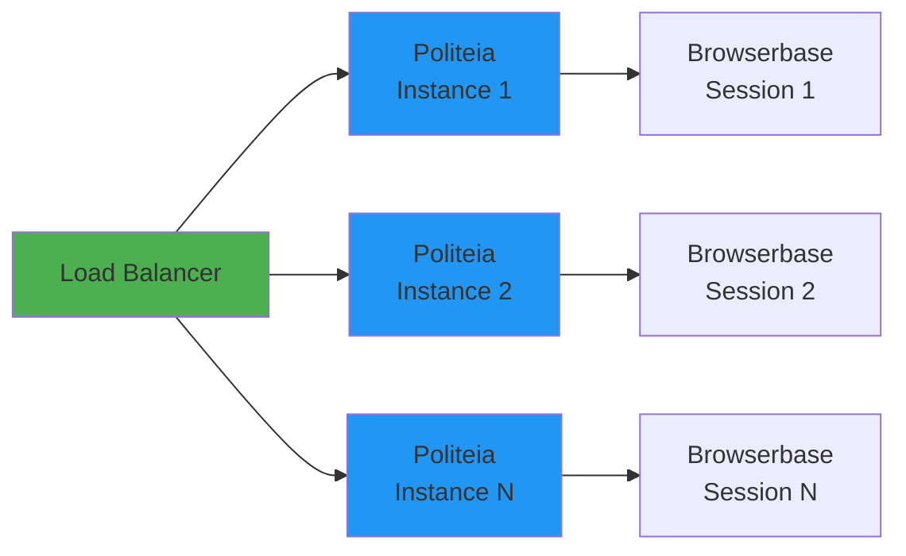
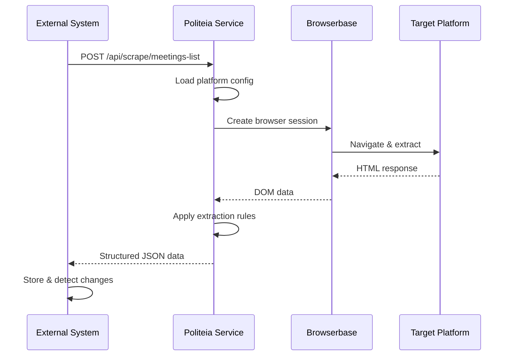

# Politeia Overview

## What is Politeia?

**Politeia** is a scalable, configuration-driven Scraping-as-a-Service platform designed to extract structured data from governmental portals, social media platforms, and custom websites.

### Core Purpose

Extract and structure public information from:
- 🏛️ **Municipal Portals** - Meeting schedules, agendas, documents
- 📱 **Social Media** - Posts, comments, engagement data
- 🌐 **Generic Websites** - Any structured content

### Key Benefits

#### 1. Configuration-Driven Architecture
```typescript
// Add a new platform with just configuration
const newPlatform: PlatformConfig = {
  name: "NewPlatform",
  selectors: { /* CSS selectors */ },
  extractionRules: { /* Field mappings */ }
};
// No code changes required!
```

#### 2. Separation of Concerns

| Component | Responsibility |
|-----------|---------------|
| **Politeia Service** | Scraping, browser automation, data extraction |
| **External System** | Scheduling, change detection, business logic, storage |

#### 3. Cost Efficiency

**Traditional Approach:**
- Browser running 24/7: **$720/month**
- High resource usage

**Politeia Approach:**
- Browser only during scraping: **$8/month**
- 90x cost reduction ✅

#### 4. Horizontal Scalability



---

## Architecture Overview

### High-Level Flow



### Two-Layer Design

#### Layer 1: Politeia Service (Scraping)
- REST API endpoints
- Platform configuration management
- Browser automation (Stagehand + Browserbase)
- Data extraction & transformation
- **Stateless** - No data persistence

#### Layer 2: External System (Business Logic)
- Request scheduling (cron jobs)
- Change detection (hash comparison)
- Data storage (Supabase)
- Business rules & notifications
- **Stateful** - Manages data & history

---

## Use Cases

### 1. Municipal Meeting Monitoring

**Problem:** Manually checking 50+ municipality websites for meeting updates

**Solution:**
```typescript
// Daily scheduled job
scheduler.daily('06:00', async () => {
  for (const municipality of municipalities) {
    const meetings = await politeia.scrapeMeetingsList({
      municipality,
      platformType: 'NOTUBIZ'
    });

    const changes = detectChanges(meetings);
    if (changes.length > 0) {
      notify(changes);
    }
  }
});
```

**Result:** Automated monitoring, instant notifications, 100% coverage

### 2. Social Media Analytics

**Problem:** Track brand mentions across platforms

**Solution:**
```typescript
const mentions = await politeia.scrape({
  platform: 'twitter',
  query: '#YourBrand',
  dateRange: 'last-24h'
});
```

**Result:** Real-time brand monitoring

### 3. Competitive Intelligence

**Problem:** Monitor competitor pricing & product changes

**Solution:**
```typescript
const products = await politeia.scrape({
  platform: 'generic',
  url: 'competitor.com/products',
  selectors: competitorConfig
});
```

**Result:** Automated price tracking

---

## System Requirements

### Politeia Service
- **Runtime:** Node.js 18+
- **Dependencies:** Express, Stagehand, Cheerio
- **External:** Browserbase account
- **Resources:** 512MB RAM, 1 CPU (per instance)

### External System
- **Database:** PostgreSQL 15+ (Supabase recommended)
- **Cache:** Redis 7+ (optional)
- **Runtime:** Any (Node.js, Python, Go)

---

## Quick Comparison

### vs. Traditional Scraping

| Feature | Traditional | Politeia |
|---------|------------|----------|
| Browser Management | Manual | Automated (Browserbase) |
| Platform Support | Hardcoded | Configuration-driven |
| Scaling | Vertical | Horizontal |
| Cost | High (24/7 browser) | Low (on-demand) |
| Maintenance | High | Low |

### vs. Scraping Libraries

| Feature | Puppeteer/Playwright | Politeia |
|---------|---------------------|----------|
| Setup Time | Hours per platform | Minutes (config file) |
| Browser Hosting | Self-hosted | Managed (Browserbase) |
| Multi-Platform | Custom code | Built-in |
| Change Detection | Build yourself | External system handles |
| API | No | Yes (REST) |

---

## Design Philosophy

### 1. **Configuration over Code**
Add platforms without programming:
```yaml
# config/platforms/new-platform.yaml
name: NewPlatform
selectors:
  meetingLinks: 'a.meeting'
  title: '.title'
```

### 2. **Microservices Architecture**
Single responsibility per service:
- Politeia: Scraping
- External: Business logic
- Browserbase: Browser infrastructure

### 3. **Fail-Safe Operations**
- Retry logic with exponential backoff
- Graceful degradation
- Comprehensive error logging

### 4. **Developer Experience**
- Clear API contracts
- Extensive documentation
- Example implementations

---

## Supported Platforms

### Current (v1.0)

#### NOTUBIZ (Decos)
- **Municipalities:** 100+
- **Coverage:** Netherlands
- **Status:** ✅ Production
- **Features:** Meetings, agendas, documents

#### IBIS
- **Municipalities:** Major cities
- **Coverage:** Netherlands
- **Status:** 🚧 Beta
- **Features:** Meetings, decisions

### Roadmap

#### Social Media (v1.1)
- YouTube - Video metadata, comments
- Facebook - Public posts, pages
- Instagram - Posts, hashtags
- X (Twitter) - Tweets, threads

#### Generic (v1.2)
- Custom website scraping
- Configurable extraction rules
- Any structured content

---

## Getting Started

Ready to use Politeia?

1. **[Quick Start Guide](./quickstart.md)** - Set up in 5 minutes
2. **[API Documentation](../03-api/external-api.md)** - API reference
3. **[Deployment Guide](../07-deployment/docker.md)** - Deploy with Docker

---

## Architecture Deep Dive

For detailed architecture information, see:
- [System Architecture](../02-architecture/system-overview.md)
- [Components](../02-architecture/components.md)
- [Data Flow](../02-architecture/data-flow.md)

---

## Next Steps

- 📖 Read the [Quick Start Guide](./quickstart.md)
- 🔧 Explore the [API Reference](../03-api/external-api.md)
- 🚀 Deploy with [Docker](../07-deployment/docker.md)
- 💡 Check [FAQ](./faq.md) for common questions

---

[← Back to Documentation Index](../README.md)
