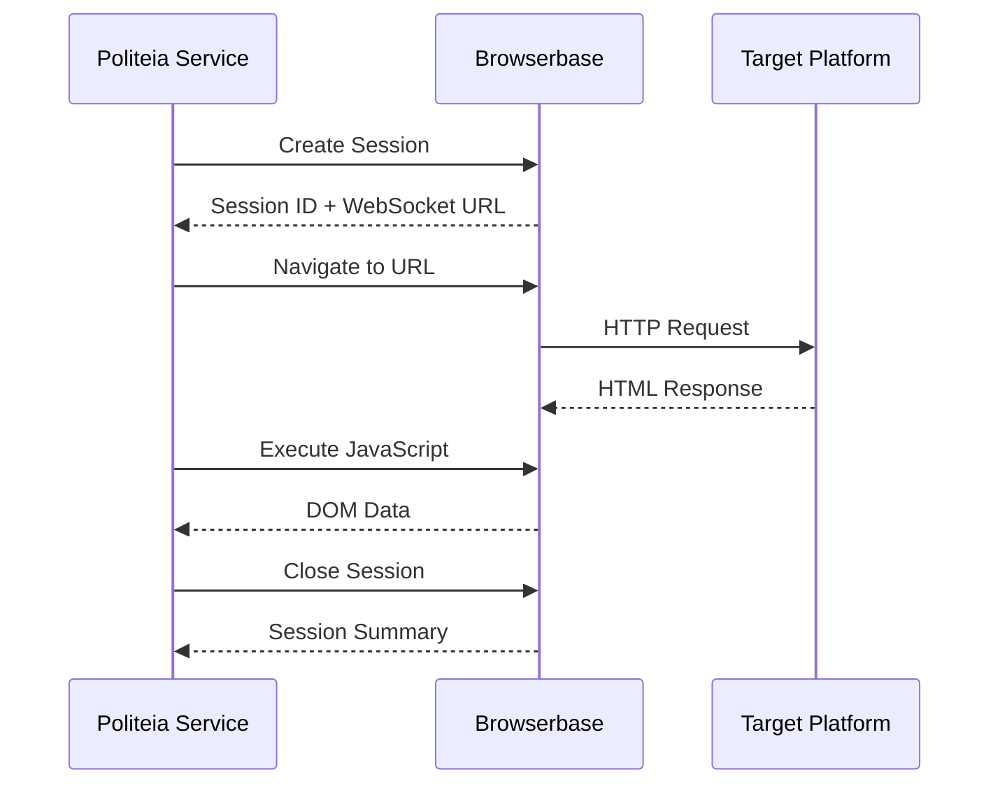
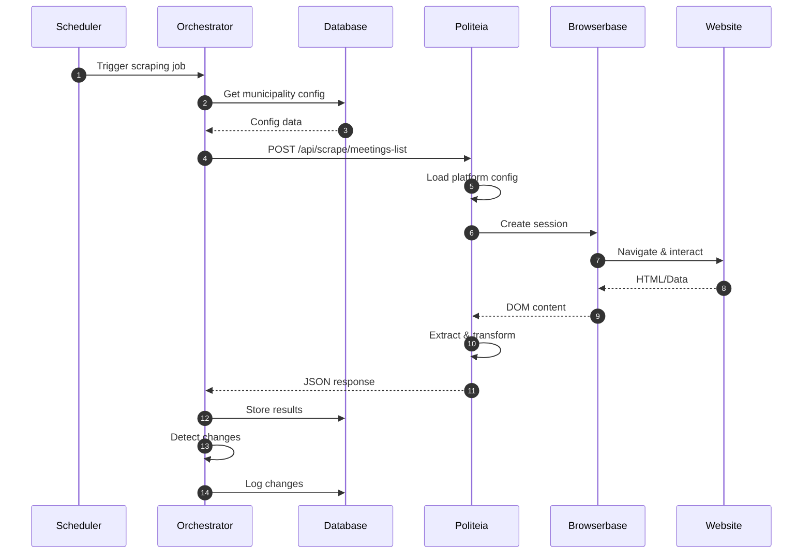
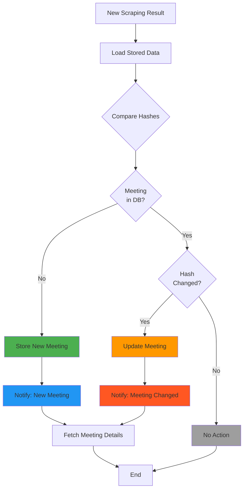
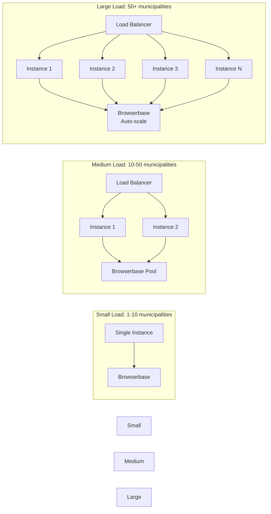
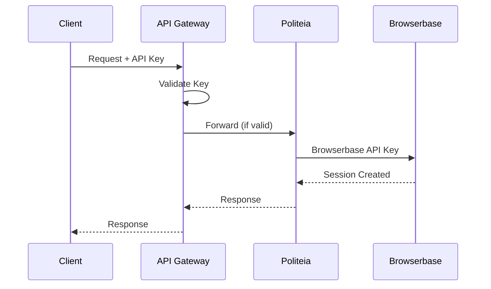

# System Architecture Overview

## High-Level Architecture

```mermaid
graph TB
    subgraph "Client Layer"
        WebUI[Web Dashboard]
        CLI[CLI Tools]
        API_Client[External API Clients]
    end

    subgraph "External System Layer"
        Scheduler[Scheduler Service<br/>Cron Jobs]
        Orchestrator[Orchestration API<br/>Request Management]
        ChangeDetector[Change Detection<br/>Hash Comparison]
        Database[(Supabase<br/>PostgreSQL)]
        Redis[(Redis Cache<br/>Optional)]
        Queue[Message Queue<br/>Optional)]
    end

    subgraph "Politeia Service Layer"
        LB[Load Balancer]
        API1[Politeia API<br/>Instance 1]
        API2[Politeia API<br/>Instance 2]
        APIN[Politeia API<br/>Instance N]

        subgraph "Core Components"
            ConfigMgr[Config Manager]
            Engine[Scraper Engine]
            ErrorHandler[Error Handler]
            Logger[Logger]
        end
    end

    subgraph "Browser Infrastructure"
        BB1[Browserbase<br/>Session 1]
        BB2[Browserbase<br/>Session 2]
        BBN[Browserbase<br/>Session N]
    end

    subgraph "Target Platforms"
        NOTUBIZ[NOTUBIZ Portals<br/>100+ Municipalities]
        IBIS[IBIS Portals<br/>Major Cities]
        Social[Social Media<br/>YouTube, X, etc]
        Custom[Custom Websites]
    end

    %% Client connections
    WebUI --> Orchestrator
    CLI --> Orchestrator
    API_Client --> Orchestrator

    %% External system flow
    Scheduler -->|Trigger| Orchestrator
    Orchestrator -->|Read/Write| Database
    Orchestrator -->|Cache| Redis
    Orchestrator -->|Enqueue| Queue
    Queue -->|Dequeue| Orchestrator

    %% Politeia service flow
    Orchestrator -->|HTTP POST| LB
    LB --> API1
    LB --> API2
    LB --> APIN

    API1 --> ConfigMgr
    API2 --> ConfigMgr
    APIN --> ConfigMgr

    ConfigMgr --> Engine
    Engine --> ErrorHandler
    Engine --> Logger

    %% Browser sessions
    Engine -->|Create Session| BB1
    Engine -->|Create Session| BB2
    Engine -->|Create Session| BBN

    %% Scraping
    BB1 -->|Scrape| NOTUBIZ
    BB1 -->|Scrape| IBIS
    BB2 -->|Scrape| Social
    BBN -->|Scrape| Custom

    %% Response flow
    Engine -->|JSON Response| Orchestrator
    Orchestrator -->|Detect Changes| ChangeDetector
    ChangeDetector -->|Store| Database

    %% Styling
    style Politeia Service Layer fill:#e3f2fd
    style External System Layer fill:#fff3e0
    style Browser Infrastructure fill:#f3e5f5
    style Target Platforms fill:#e8f5e9
```

---

## Architectural Layers

### 1. Client Layer
**Purpose:** Interface for users and systems

**Components:**
- **Web Dashboard** - Visual interface for monitoring
- **CLI Tools** - Command-line interface
- **API Clients** - Programmatic access

**Technology:**
- React/Next.js for web UI
- Node.js/Python for CLI
- REST/GraphQL for API

---

### 2. External System Layer
**Purpose:** Business logic, scheduling, and data management

**Components:**

#### Scheduler Service
- **Function:** Triggers scraping jobs at defined intervals
- **Technology:** Cron, Node-cron, Celery
- **Example:**
```typescript
// Daily at 6:00 AM
cron.schedule('0 6 * * *', async () => {
  await orchestrator.scrapeAll();
});
```

#### Orchestration API
- **Function:** Coordinates scraping requests
- **Responsibilities:**
  - Request validation
  - Load balancing
  - Response aggregation
  - Error handling

#### Change Detection
- **Function:** Compares current vs stored data
- **Method:** SHA-256 hash comparison
- **Example:**
```typescript
const hash = crypto
  .createHash('sha256')
  .update(JSON.stringify(meetingBasics))
  .digest('hex');
```

#### Database (Supabase)
- **Function:** Persistent storage
- **Tables:**
  - `municipalities` - Municipality configurations
  - `meetings` - Meeting records
  - `meeting_details` - Detailed agenda/attachments
  - `scrape_logs` - Execution history
  - `changes` - Change history

#### Redis Cache (Optional)
- **Function:** Performance optimization
- **Cached Data:**
  - Platform configurations
  - Recent scraping results
  - Rate limit counters

#### Message Queue (Optional)
- **Function:** Async job processing
- **Technology:** RabbitMQ, Redis Queue, SQS
- **Use Cases:**
  - Large batch jobs
  - Retry failed requests
  - Priority queuing

---

### 3. Politeia Service Layer
**Purpose:** Scraping execution and data extraction

**Components:**

#### Load Balancer
- **Function:** Distributes requests across instances
- **Technology:** nginx, HAProxy, AWS ALB
- **Strategy:** Round-robin, least connections

#### Politeia API Instances
- **Function:** Handle scraping requests
- **Stateless:** No session data stored
- **Horizontal Scaling:** Add instances as needed

#### Config Manager
- **Function:** Manages platform configurations
- **Storage:** File-based YAML/JSON
- **Features:**
  - Hot reload
  - Version control
  - Override support

#### Scraper Engine
- **Function:** Core scraping logic
- **Technology:** Stagehand + Browserbase
- **Capabilities:**
  - Browser automation
  - DOM parsing
  - Data extraction
  - Error recovery

#### Error Handler
- **Function:** Centralized error management
- **Features:**
  - Retry logic
  - Error categorization
  - Fallback strategies
  - Alerting

#### Logger
- **Function:** Comprehensive logging
- **Levels:** DEBUG, INFO, WARN, ERROR
- **Output:** Console, File, Cloud (CloudWatch, Datadog)

---

### 4. Browser Infrastructure
**Purpose:** Remote browser execution

**Provider:** Browserbase

**Features:**
- **Managed Browsers:** No infrastructure management
- **Scaling:** Automatic session scaling
- **Debugging:** Live debugging tools
- **Monitoring:** Session recordings

**Session Lifecycle:**


---

### 5. Target Platforms
**Purpose:** Data sources

**Categories:**

#### Governmental Portals
- **NOTUBIZ** - 100+ Dutch municipalities
- **IBIS** - Major cities (Amsterdam, Rotterdam)
- **Custom** - Municipality-specific systems

#### Social Media
- **YouTube** - Videos, comments, metadata
- **X (Twitter)** - Tweets, threads, profiles
- **Facebook** - Public posts, pages
- **Instagram** - Posts, stories, hashtags

#### Generic Websites
- Any website with structured content
- Configurable extraction rules

---

## Data Flow

### Request Flow



### Change Detection Flow



---

## Scaling Strategies

### Horizontal Scaling



### Vertical Optimization

| Component | Small | Medium | Large |
|-----------|-------|--------|-------|
| **CPU** | 1 core | 2 cores | 4+ cores |
| **Memory** | 512MB | 2GB | 4GB+ |
| **Instances** | 1 | 2-3 | 5+ |
| **Concurrent Sessions** | 5 | 20 | 50+ |

---

## Communication Patterns

### Synchronous Pattern (Small Scale)

```typescript
// Direct HTTP request-response
const result = await politeia.scrapeMeetings(municipality);
await database.store(result);
```

**Pros:**
- Simple implementation
- Immediate response
- Easy debugging

**Cons:**
- Blocks caller
- No retry logic
- Limited scalability

### Asynchronous Pattern (Large Scale)

```typescript
// Enqueue job
await queue.enqueue({
  type: 'scrape-meetings',
  municipality: municipality.id
});

// Worker processes job
queue.on('job', async (job) => {
  const result = await politeia.scrapeMeetings(job.data.municipality);
  await database.store(result);
  await queue.complete(job.id);
});
```

**Pros:**
- Non-blocking
- Built-in retry
- Scalable workers

**Cons:**
- More complex
- Eventual consistency
- Requires queue infrastructure

---

## Security Architecture

### Authentication



**Layers:**
1. **Client → API Gateway:** API key or JWT token
2. **API Gateway → Politeia:** Internal authentication
3. **Politeia → Browserbase:** Browserbase API credentials

### Rate Limiting

```typescript
// Per-client rate limits
const rateLimits = {
  requestsPerMinute: 60,
  requestsPerHour: 1000,
  requestsPerDay: 10000
};

// Per-municipality rate limits
const municipalityLimits = {
  requestsPerHour: 10,  // Be respectful
  backoffMs: 5000        // Wait between requests
};
```

---

## Monitoring & Observability

### Key Metrics

| Metric | Description | Alert Threshold |
|--------|-------------|----------------|
| **Request Rate** | Requests per minute | > 100/min |
| **Success Rate** | % successful scrapes | < 95% |
| **Response Time** | Average duration | > 30s |
| **Error Rate** | % failed requests | > 5% |
| **Queue Depth** | Pending jobs | > 1000 |
| **Browser Sessions** | Active sessions | > 50 |

### Logging Strategy

```typescript
// Structured logging
logger.info('Scraping started', {
  requestId: 'uuid',
  municipality: 'oirschot',
  platformType: 'NOTUBIZ',
  timestamp: new Date().toISOString()
});

logger.error('Scraping failed', {
  requestId: 'uuid',
  error: error.message,
  stack: error.stack,
  retryCount: 3
});
```

---

## Deployment Architecture

See detailed deployment guides:
- [Docker Deployment](../07-deployment/docker.md)
- [Kubernetes Deployment](../07-deployment/kubernetes.md)
- [Serverless Deployment](../07-deployment/serverless.md)

---

## Related Documentation

- [Components Deep Dive](./components.md)
- [Data Flow](./data-flow.md)
- [API Reference](../03-api/external-api.md)

---

[← Back to Documentation Index](../README.md)
