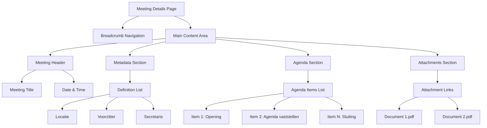

# NOTUBIZ Platform Configuration

Complete configuration documentation for the NOTUBIZ platform (Decos).

---

## Overview

**NOTUBIZ** is a meeting management system by Decos, used by 100+ Dutch municipalities.

### Characteristics

- **Vendor:** Decos
- **URL Pattern:** `https://{municipality}.bestuurlijkeinformatie.nl`
- **Rendering:** Server-side (HTML)
- **JavaScript Required:** No (for basic scraping)
- **Version:** Current configuration targets 2025 NOTUBIZ version

---

## Configuration Schema

```yaml
platform:
  type: NOTUBIZ
  version: "1.0.0"
  vendor: Decos

baseUrl: "https://{municipality}.bestuurlijkeinformatie.nl"

features:
  - meetings-list
  - meeting-details
  - attachments
  - agenda-items

selectors:
  calendar:
    monthDropdown: "#CurrentMonth"
    yearDropdown: "#CurrentYear"
    meetingLinks: 'a[href*="/Agenda/Index/"]'

  meetingList:
    container: ".vergader-lijst"
    items: ".vergader-item"
    title: ".vergader-titel"
    date: ".vergader-datum"
    time: ".vergader-tijd"

  meetingDetails:
    mainContent: "main.main-content"
    breadcrumb: ".breadcrumb"
    title: "h1"
    metadata: "dl"
    metadataKey: "dt"
    metadataValue: "dd"
    agendaList: ".agendapunten"
    agendaItem: ".agendapunt"
    attachmentsList: ".bijlagen"
    attachment: ".bijlage"

extraction:
  meetingIdPattern: "/Agenda/Index/([a-f0-9-]+)"
  dateFormat: "DD MMMM YYYY"
  timeFormat: "HH:mm"
```

---

## Selector Mapping

### Calendar Navigation

| Element | Selector | Description |
|---------|----------|-------------|
| **Month Dropdown** | `#CurrentMonth` | Month selector (0-11, 0=January) |
| **Year Dropdown** | `#CurrentYear` | Year selector (e.g., 2025) |
| **Meeting Links** | `a[href*="/Agenda/Index/"]` | All meeting links in calendar |

**Example HTML:**
```html
<select id="CurrentMonth" name="CurrentMonth">
  <option value="0">januari</option>
  <option value="1">februari</option>
  <!-- ... -->
  <option value="9" selected>oktober</option>
</select>

<select id="CurrentYear" name="CurrentYear">
  <option value="2024">2024</option>
  <option value="2025" selected>2025</option>
  <option value="2026">2026</option>
</select>
```

### Meeting List Extraction

| Field | Selector | Extraction Method |
|-------|----------|-------------------|
| **Meeting ID** | `href` attribute | Regex: `/Agenda/Index/([a-f0-9-]+)` |
| **Title** | Link text | `.trim()` |
| **URL** | `href` attribute | Full URL |

**Example HTML:**
```html
<a href="/Agenda/Index/b465214f-a570-45ba-85b9-c4d02bc5b107">
  Auditcommissie
</a>
```

**Extraction:**
```typescript
const meetings = await page.evaluate(() => {
  const links = document.querySelectorAll('a[href*="/Agenda/Index/"]');
  return Array.from(links).map(link => ({
    id: link.href.match(/\/Agenda\/Index\/([a-f0-9-]+)/i)?.[1],
    title: link.textContent?.trim(),
    url: link.href
  }));
});
```

---

## Meeting Details Page Structure

### Page Layout



### Metadata Extraction

**HTML Structure:**
```html
<dl>
  <dt>Locatie</dt>
  <dd>Commissiekamer beneden</dd>

  <dt>Voorzitter</dt>
  <dd>M. van Leeuwen</dd>

  <dt>Agenda documenten</dt>
  <dd>251007 Agenda Auditcommissie</dd>
</dl>
```

**Extraction:**
```typescript
const metadata = await page.evaluate(() => {
  const dl = document.querySelector('dl');
  const dts = dl?.querySelectorAll('dt');
  const dds = dl?.querySelectorAll('dd');

  const meta: Record<string, string> = {};
  dts?.forEach((dt, index) => {
    meta[dt.textContent?.trim() || ''] = dds?.[index]?.textContent?.trim() || '';
  });

  return meta;
});
```

**Result:**
```json
{
  "Locatie": "Commissiekamer beneden",
  "Voorzitter": "M. van Leeuwen",
  "Agenda documenten": "251007 Agenda Auditcommissie"
}
```

---

## Agenda Items Extraction

### Structure Types

**1. Simple Items (No Nesting)**
```html
<div class="agendapunt">
  <span class="nummer">1</span>
  <span class="titel">Opening</span>
</div>
```

**2. Nested Items (Parent-Child)**
```html
<div class="agendapunt parent">
  <span class="nummer">2</span>
  <span class="titel">Vaststellen agenda</span>

  <div class="agendapunt child">
    <span class="nummer">2.A</span>
    <span class="titel">Ingekomen stukken</span>
  </div>

  <div class="agendapunt child">
    <span class="nummer">2.B</span>
    <span class="titel">Mededelingen</span>
  </div>
</div>
```

### Extraction Logic

```typescript
interface AgendaItem {
  index: number;
  number: string;
  title: string;
  description?: string;
  hasSubItems: boolean;
  isSubItem: boolean;
  parentIndex?: number;
  attachments: Attachment[];
}

async function extractAgendaItems(page: Page): Promise<AgendaItem[]> {
  return await page.evaluate(() => {
    const items = document.querySelectorAll('.agendapunt');
    const results: AgendaItem[] = [];

    items.forEach((item, index) => {
      const number = item.querySelector('.nummer')?.textContent?.trim() || '';
      const title = item.querySelector('.titel')?.textContent?.trim() || '';
      const isSubItem = item.classList.contains('child');
      const hasSubItems = item.querySelectorAll('.agendapunt.child').length > 0;

      // Find parent if this is a sub-item
      let parentIndex: number | undefined;
      if (isSubItem) {
        const parent = item.closest('.agendapunt.parent');
        parentIndex = Array.from(items).indexOf(parent);
      }

      results.push({
        index,
        number,
        title,
        hasSubItems,
        isSubItem,
        parentIndex
      });
    });

    return results;
  });
}
```

---

## Attachments Extraction

### Attachment Types

| Type | Extension | Selector Pattern |
|------|-----------|------------------|
| **PDF** | `.pdf` | `a[href$=".pdf"]` |
| **Word** | `.doc`, `.docx` | `a[href$=".doc"], a[href$=".docx"]` |
| **Excel** | `.xls`, `.xlsx` | `a[href$=".xls"], a[href$=".xlsx"]` |
| **Document** | Generic | `a[href*="/Document/"]` |

### HTML Structure

```html
<div class="bijlagen">
  <a href="/Document/Download?id=abc123" class="bijlage">
    <span class="icon pdf"></span>
    <span class="naam">Agenda Auditcommissie 7 oktober.pdf</span>
    <span class="grootte">108 KB</span>
  </a>

  <a href="/Document/View?id=abc123" class="view-link">
    Bekijken
  </a>
</div>
```

### Extraction

```typescript
interface Attachment {
  id: string;
  name: string;
  type: 'pdf' | 'word' | 'excel' | 'document';
  url: string;
  viewUrl?: string;
  extension: string;
  size?: number;
}

async function extractAttachments(page: Page): Promise<Attachment[]> {
  return await page.evaluate(() => {
    const attachmentLinks = document.querySelectorAll('a[href*="/Document/"]');
    const attachments: Attachment[] = [];

    attachmentLinks.forEach(link => {
      const href = link.getAttribute('href');
      if (!href?.includes('Download')) return;

      const id = href.match(/id=([^&]+)/)?.[1] || '';
      const name = link.querySelector('.naam')?.textContent?.trim() || '';
      const sizeText = link.querySelector('.grootte')?.textContent?.trim();

      // Determine type from extension
      const extension = name.match(/\.(\w+)$/)?.[1]?.toLowerCase() || '';
      let type: 'pdf' | 'word' | 'excel' | 'document' = 'document';
      if (extension === 'pdf') type = 'pdf';
      else if (['doc', 'docx'].includes(extension)) type = 'word';
      else if (['xls', 'xlsx'].includes(extension)) type = 'excel';

      // Parse size
      let size: number | undefined;
      if (sizeText) {
        const match = sizeText.match(/(\d+)\s*(KB|MB)/);
        if (match) {
          size = parseInt(match[1]) * (match[2] === 'MB' ? 1024 : 1) * 1024;
        }
      }

      attachments.push({
        id,
        name,
        type,
        url: link.href,
        extension: `.${extension}`,
        size
      });
    });

    return attachments;
  });
}
```

---

## Meeting Type Detection

### Types Observed

From validation data (October 2025), we identified 3 main types:

| Type | Dutch Name | Frequency | Characteristics |
|------|------------|-----------|-----------------|
| **Committee Meeting** | Commissievergadering | Common | 5-15 agenda items, technical topics |
| **Council Gathering** | Raadsbijeenkomst | Common | Informational, varies in size |
| **Council Decision Meeting** | Besluitvormende raadsvergadering | Monthly | 10-20 items, formal decisions |

### Detection Logic

```typescript
function detectMeetingType(title: string): string {
  const normalized = title.toLowerCase().trim();

  if (normalized.includes('commissievergadering') || normalized.includes('commissie')) {
    return 'Commissievergadering';
  }

  if (normalized.includes('raadsbijeenkomst')) {
    return 'Raadsbijeenkomst';
  }

  if (normalized.includes('besluitvormende') && normalized.includes('raad')) {
    return 'Besluitvormende raadsvergadering';
  }

  if (normalized.includes('raadsvergadering') || normalized.includes('raad')) {
    return 'Raadsvergadering';
  }

  // Default
  return 'Overig';
}
```

### Status Detection

```typescript
function detectStatus(title: string, agendaItemsCount: number): string {
  const normalized = title.toLowerCase();

  // Cancelled meetings
  if (normalized.includes('vervallen') || normalized.includes('afgezegd')) {
    return 'cancelled';
  }

  // No agenda = likely not finalized
  if (agendaItemsCount === 0) {
    return 'scheduled';
  }

  // Check date
  const meetingDate = extractDate(title);
  if (meetingDate && meetingDate < new Date()) {
    return 'completed';
  }

  return 'scheduled';
}
```

---

## Municipality-Specific Overrides

### Configuration Override System

```typescript
interface MunicipalityConfig {
  id: string;
  name: string;
  platformType: 'NOTUBIZ';
  baseUrl: string;
  overrides?: PlatformConfigOverrides;
}

interface PlatformConfigOverrides {
  selectors?: Partial<NotubizSelectors>;
  extraction?: Partial<ExtractionRules>;
  features?: string[];
}
```

### Example Override

**Oirschot** (uses standard NOTUBIZ):
```json
{
  "id": "oirschot",
  "name": "Oirschot",
  "platformType": "NOTUBIZ",
  "baseUrl": "https://oirschot.bestuurlijkeinformatie.nl",
  "overrides": null
}
```

**Hypothetical municipality with custom selectors:**
```json
{
  "id": "custom-city",
  "name": "Custom City",
  "platformType": "NOTUBIZ",
  "baseUrl": "https://custom-city.bestuurlijkeinformatie.nl",
  "overrides": {
    "selectors": {
      "meetingDetails": {
        "agendaList": ".custom-agenda-container",
        "agendaItem": ".custom-agenda-item"
      }
    }
  }
}
```

---

## Example Municipalities

### Active NOTUBIZ Municipalities

| Municipality | Province | Base URL |
|--------------|----------|----------|
| **Oirschot** | Noord-Brabant | https://oirschot.bestuurlijkeinformatie.nl |
| **Best** | Noord-Brabant | https://best.bestuurlijkeinformatie.nl |
| **Eindhoven** | Noord-Brabant | https://eindhoven.bestuurlijkeinformatie.nl |
| **Tilburg** | Noord-Brabant | https://tilburg.bestuurlijkeinformatie.nl |
| **Utrecht** | Utrecht | https://utrecht.bestuurlijkeinformatie.nl |

---

## Error Handling

### Common Issues

#### 1. Selector Not Found

**Error:**
```
Could not find element for selector: #CurrentMonth
```

**Possible Causes:**
- NOTUBIZ HTML structure changed
- JavaScript not loaded (if using browser automation)
- Municipality uses custom template

**Solution:**
```typescript
try {
  await page.waitForSelector('#CurrentMonth', { timeout: 5000 });
} catch (error) {
  // Fallback to alternative selector
  await page.waitForSelector('select[name="CurrentMonth"]');
}
```

#### 2. No Meetings Found

**Error:**
```
0 meetings extracted for October 2025
```

**Possible Causes:**
- No meetings scheduled
- Wrong month/year parameters
- Selector changed

**Solution:**
```typescript
const meetings = await extractMeetings(page);
if (meetings.length === 0) {
  // Log page HTML for debugging
  const html = await page.content();
  logger.warn('No meetings found', { html: html.substring(0, 1000) });

  // Take screenshot
  await page.screenshot({ path: 'debug-no-meetings.png' });
}
```

#### 3. Cancelled Meetings (VERVALLEN)

**Special Case:**
Cancelled meetings have title "VERVALLEN" and no agenda/attachments.

**Handling:**
```typescript
function processMeeting(meeting: Meeting): ProcessedMeeting {
  if (meeting.title.toLowerCase().includes('vervallen')) {
    return {
      ...meeting,
      status: 'cancelled',
      agendaItems: [],
      attachments: [],
      skipDetailScrape: true
    };
  }

  return meeting;
}
```

---

## Performance Optimization

### Direct HTTP vs Browser Automation

**NOTUBIZ is server-side rendered**, so you can use direct HTTP + Cheerio for better performance:

```typescript
import axios from 'axios';
import * as cheerio from 'cheerio';

async function scrapeMeetingsListDirect(
  baseUrl: string,
  month: number,
  year: number
): Promise<Meeting[]> {
  const url = `${baseUrl}/Calendar?month=${month}&year=${year}`;
  const response = await axios.get(url);
  const $ = cheerio.load(response.data);

  const meetings: Meeting[] = [];
  $('a[href*="/Agenda/Index/"]').each((i, elem) => {
    const link = $(elem);
    meetings.push({
      id: link.attr('href')?.match(/\/Agenda\/Index\/([a-f0-9-]+)/)?.[1] || '',
      title: link.text().trim(),
      url: baseUrl + link.attr('href')
    });
  });

  return meetings;
}
```

**Performance Comparison:**

| Method | Time per Municipality | Cost |
|--------|----------------------|------|
| **Browserbase** | 3-5 seconds | $0.001 per session |
| **Direct HTTP** | 0.5-1 seconds | Free (just server costs) |

**Recommendation:**
- Use **Direct HTTP** for routine daily scraping
- Use **Browserbase** for:
  - Testing new municipalities
  - Debugging selector issues
  - Handling CAPTCHA or rate limits

---

## Testing Strategy

### Validation Checklist

- [ ] Calendar navigation (all 12 months)
- [ ] Meeting list extraction
- [ ] Meeting ID parsing
- [ ] Meeting details page
- [ ] Metadata extraction
- [ ] Agenda items (simple + nested)
- [ ] Attachments extraction
- [ ] Meeting type detection
- [ ] Status detection (scheduled, cancelled, completed)
- [ ] Edge cases (VERVALLEN, no agenda, no attachments)

### Test Script

```typescript
async function validateNotubizMunicipality(config: MunicipalityConfig) {
  const results = {
    calendarNavigation: false,
    meetingsExtracted: 0,
    detailsScraped: 0,
    errors: []
  };

  try {
    // Test calendar navigation
    const meetings = await scrapeMeetingsList(config, 10, 2025);
    results.calendarNavigation = true;
    results.meetingsExtracted = meetings.length;

    // Test details scraping
    for (const meeting of meetings.slice(0, 3)) {
      const details = await scrapeMeetingDetails(config, meeting.id);
      if (details) results.detailsScraped++;
    }

  } catch (error) {
    results.errors.push(error.message);
  }

  return results;
}
```

---

## Related Documentation

- [Version Management](./version-management.md)
- [Adding New Platforms](./adding-new-platforms.md)
- [API Reference](../03-api/external-api.md)
- [Browserbase Integration](../05-browserbase/session-management.md)

---

[← Back to Documentation Index](../README.md)
