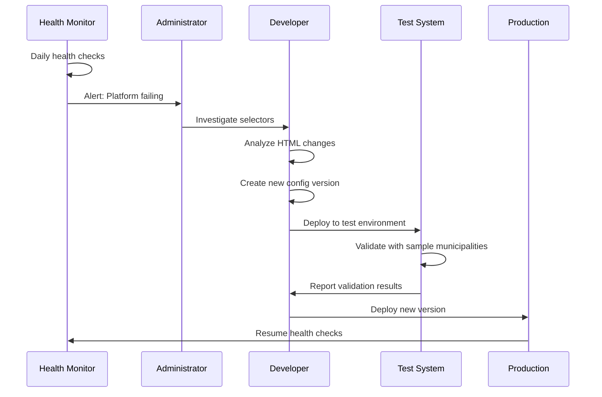

# Platform Version Management

Strategy and procedures for managing platform configuration changes.

---

## Overview

Governmental platforms like NOTUBIZ and IBIS periodically update their HTML structure, breaking existing selectors. This document outlines how Politeia handles versioning and migrations.

---

## Versioning Strategy

### Semantic Versioning

Platform configurations use semantic versioning:

```
MAJOR.MINOR.PATCH

Examples:
- 1.0.0 - Initial NOTUBIZ configuration
- 1.1.0 - Added attachment extraction
- 1.1.1 - Fixed selector for cancelled meetings
- 2.0.0 - NOTUBIZ HTML structure changed (breaking)
```

**Rules:**
- **MAJOR**: Breaking changes (selectors changed, HTML restructure)
- **MINOR**: New features (new extraction capabilities)
- **PATCH**: Bug fixes (selector refinements, edge cases)

---

## Configuration Versioning

### File Structure

```
/config/platforms/
├── notubiz/
│   ├── v1.0.0.yaml
│   ├── v1.1.0.yaml
│   ├── v2.0.0.yaml
│   └── current.yaml -> v2.0.0.yaml  (symlink)
├── ibis/
│   ├── v0.9.0.yaml
│   └── current.yaml -> v0.9.0.yaml
└── versions.json
```

### versions.json

```json
{
  "platforms": {
    "NOTUBIZ": {
      "current": "2.0.0",
      "supported": ["1.1.0", "2.0.0"],
      "deprecated": ["1.0.0"],
      "history": [
        {
          "version": "2.0.0",
          "releaseDate": "2025-09-15",
          "changes": "Major HTML restructure by Decos",
          "breakingChanges": true,
          "migrationGuide": "docs/migrations/notubiz-v1-to-v2.md"
        },
        {
          "version": "1.1.0",
          "releaseDate": "2025-03-10",
          "changes": "Added attachment extraction",
          "breakingChanges": false
        }
      ]
    },
    "IBIS": {
      "current": "0.9.0",
      "supported": ["0.9.0"],
      "deprecated": [],
      "history": [
        {
          "version": "0.9.0",
          "releaseDate": "2025-10-01",
          "changes": "Initial IBIS support",
          "breakingChanges": false
        }
      ]
    }
  }
}
```

---

## Detection & Monitoring

### Automatic Detection

**Health Check System:**

```typescript
interface PlatformHealthCheck {
  municipalityId: string;
  platformType: string;
  platformVersion: string;
  lastChecked: Date;
  status: 'healthy' | 'degraded' | 'failed';
  errors: string[];
}

async function checkPlatformHealth(
  config: MunicipalityConfig
): Promise<PlatformHealthCheck> {
  const result: PlatformHealthCheck = {
    municipalityId: config.id,
    platformType: config.platformType,
    platformVersion: getCurrentVersion(config.platformType),
    lastChecked: new Date(),
    status: 'healthy',
    errors: []
  };

  try {
    // Test critical selectors
    const page = await createBrowserPage(config.baseUrl);

    const checks = [
      checkSelector(page, '#CurrentMonth', 'Month dropdown'),
      checkSelector(page, '#CurrentYear', 'Year dropdown'),
      checkSelector(page, 'a[href*="/Agenda/Index/"]', 'Meeting links'),
    ];

    const results = await Promise.all(checks);

    const failures = results.filter(r => !r.found);
    if (failures.length > 0) {
      result.status = failures.length > 2 ? 'failed' : 'degraded';
      result.errors = failures.map(f => f.error);
    }

  } catch (error) {
    result.status = 'failed';
    result.errors.push(error.message);
  }

  return result;
}

async function checkSelector(
  page: Page,
  selector: string,
  name: string
): Promise<{ found: boolean; error?: string }> {
  try {
    await page.waitForSelector(selector, { timeout: 5000 });
    return { found: true };
  } catch (error) {
    return {
      found: false,
      error: `Selector not found: ${name} (${selector})`
    };
  }
}
```

### Scheduled Health Checks

```typescript
// Run daily health checks for all municipalities
cron.schedule('0 2 * * *', async () => {
  const municipalities = await database.getAllMunicipalities();

  for (const municipality of municipalities) {
    const health = await checkPlatformHealth(municipality);

    await database.storePlatformHealth(health);

    if (health.status === 'failed') {
      await alerting.sendAlert({
        type: 'PLATFORM_FAILURE',
        municipality: municipality.name,
        errors: health.errors
      });
    }
  }
});
```

---

## Migration Process

### Workflow



### Steps

#### 1. Detection

```bash
# Health check detects failures
✗ Oirschot (NOTUBIZ): Selector not found: #CurrentMonth
✗ Best (NOTUBIZ): Selector not found: #CurrentMonth
✓ Amsterdam (IBIS): Healthy
```

#### 2. Investigation

```typescript
// Fetch current HTML structure
const response = await axios.get('https://oirschot.bestuurlijkeinformatie.nl');
const $ = cheerio.load(response.data);

// Analyze changed structure
console.log('Month selector options:');
$('select').each((i, elem) => {
  console.log(`  ID: ${$(elem).attr('id')}, Name: ${$(elem).attr('name')}`);
});

// Output:
// ID: month-selector, Name: CurrentMonth  (ID changed!)
```

#### 3. Create New Version

```yaml
# config/platforms/notubiz/v2.1.0.yaml
platform:
  type: NOTUBIZ
  version: "2.1.0"

changes:
  - "Updated month selector ID from #CurrentMonth to #month-selector"
  - "Updated year selector ID from #CurrentYear to #year-selector"

selectors:
  calendar:
    monthDropdown: "#month-selector"  # Changed
    yearDropdown: "#year-selector"     # Changed
    meetingLinks: 'a[href*="/Agenda/Index/"]'  # Unchanged
```

#### 4. Test Migration

```typescript
// migration-test.ts
async function testMigration() {
  const municipalities = [
    'oirschot',
    'best',
    'eindhoven'
  ];

  for (const id of municipalities) {
    console.log(`Testing ${id}...`);

    const config = loadConfig(id, 'NOTUBIZ', '2.1.0');
    const meetings = await scrapeMeetingsList(config, 10, 2025);

    console.log(`  ✓ Found ${meetings.length} meetings`);

    if (meetings.length > 0) {
      const details = await scrapeMeetingDetails(config, meetings[0].id);
      console.log(`  ✓ Scraped details: ${details.agendaItems.length} items`);
    }
  }
}
```

#### 5. Deploy

```bash
# Update symlink to new version
cd config/platforms/notubiz
ln -sf v2.1.0.yaml current.yaml

# Restart service
docker-compose restart politeia-service

# Verify
curl http://localhost:3000/api/platforms
# Should show NOTUBIZ version 2.1.0
```

#### 6. Monitor

```bash
# Check health after deployment
npm run health-check:all

# Expected output:
✓ Oirschot (NOTUBIZ v2.1.0): Healthy
✓ Best (NOTUBIZ v2.1.0): Healthy
✓ Eindhoven (NOTUBIZ v2.1.0): Healthy
```

---

## Rollback Strategy

### Quick Rollback

If new version fails:

```bash
# Revert symlink
cd config/platforms/notubiz
ln -sf v2.0.0.yaml current.yaml

# Restart service
docker-compose restart politeia-service

# Verify rollback
curl http://localhost:3000/api/platforms
```

### Gradual Rollout

Deploy to subset of municipalities first:

```json
{
  "gradualRollout": {
    "platformType": "NOTUBIZ",
    "targetVersion": "2.1.0",
    "stages": [
      {
        "name": "Pilot",
        "percentage": 10,
        "municipalities": ["oirschot", "best"],
        "duration": "7 days"
      },
      {
        "name": "Phase 1",
        "percentage": 30,
        "duration": "7 days"
      },
      {
        "name": "Phase 2",
        "percentage": 100,
        "duration": "ongoing"
      }
    ]
  }
}
```

---

## Municipality-Specific Versions

### Per-Municipality Override

Some municipalities may lag behind platform updates:

```typescript
interface MunicipalityConfig {
  id: string;
  name: string;
  platformType: 'NOTUBIZ';
  platformVersion?: string;  // Optional override
  baseUrl: string;
}

// Example: Oirschot still on old version
const oirschotConfig = {
  id: 'oirschot',
  name: 'Oirschot',
  platformType: 'NOTUBIZ',
  platformVersion: '1.1.0',  // Override to use old config
  baseUrl: 'https://oirschot.bestuurlijkeinformatie.nl'
};

function loadPlatformConfig(municipality: MunicipalityConfig) {
  const version = municipality.platformVersion
    || getCurrentVersion(municipality.platformType);

  return require(`./config/platforms/${municipality.platformType}/v${version}.yaml`);
}
```

---

## Change Notification

### Changelog

**NOTUBIZ v2.0.0 → v2.1.0**

```markdown
# NOTUBIZ Configuration v2.1.0

**Release Date:** 2025-11-15

## Breaking Changes
None

## Changes
- Updated month selector: `#CurrentMonth` → `#month-selector`
- Updated year selector: `#CurrentYear` → `#year-selector`

## Affected Municipalities
All NOTUBIZ municipalities

## Migration Required
No code changes required. Configuration update only.

## Testing
Validated with 10 municipalities:
- ✓ Oirschot
- ✓ Best
- ✓ Eindhoven
- ✓ (7 more...)

## Rollback
If issues occur, revert to v2.0.0:
```bash
ln -sf v2.0.0.yaml current.yaml
docker-compose restart politeia-service
```
```

### Email Notification

```typescript
async function notifyConfigurationChange(version: PlatformVersion) {
  const admins = await database.getAdministrators();

  await email.send({
    to: admins.map(a => a.email),
    subject: `Politeia: ${version.platformType} updated to v${version.number}`,
    body: `
      Platform Configuration Update

      Platform: ${version.platformType}
      Version: ${version.number}
      Release Date: ${version.releaseDate}

      Changes:
      ${version.changes.map(c => `- ${c}`).join('\n')}

      Breaking Changes: ${version.breakingChanges ? 'YES' : 'NO'}

      ${version.migrationGuide ? `Migration Guide: ${version.migrationGuide}` : ''}

      Testing Status: ${version.testResults.passed}/${version.testResults.total} passed

      Deployment: Scheduled for ${version.deploymentDate}
    `
  });
}
```

---

## Testing Strategy

### Pre-Deployment Tests

```typescript
interface ConfigValidationResult {
  version: string;
  valid: boolean;
  errors: string[];
  warnings: string[];
  testedMunicipalities: string[];
  passRate: number;
}

async function validateConfiguration(
  platformType: string,
  version: string
): Promise<ConfigValidationResult> {
  const result: ConfigValidationResult = {
    version,
    valid: true,
    errors: [],
    warnings: [],
    testedMunicipalities: [],
    passRate: 0
  };

  // 1. Schema validation
  const config = loadConfig(platformType, version);
  const schemaValid = validateSchema(config);
  if (!schemaValid) {
    result.valid = false;
    result.errors.push('Configuration schema invalid');
    return result;
  }

  // 2. Test with sample municipalities
  const testMunicipalities = getTestMunicipalities(platformType, 5);
  let passed = 0;

  for (const municipality of testMunicipalities) {
    try {
      const meetings = await scrapeMeetingsList(municipality, 10, 2025);
      if (meetings.length > 0) {
        const details = await scrapeMeetingDetails(municipality, meetings[0].id);
        if (details.agendaItems.length > 0) {
          passed++;
          result.testedMunicipalities.push(municipality.id);
        }
      }
    } catch (error) {
      result.errors.push(`${municipality.id}: ${error.message}`);
    }
  }

  result.passRate = passed / testMunicipalities.length;
  result.valid = result.passRate >= 0.8;  // 80% pass threshold

  return result;
}
```

### Continuous Validation

```typescript
// Run validation after every deployment
cron.schedule('0 */6 * * *', async () => {
  const platforms = ['NOTUBIZ', 'IBIS'];

  for (const platform of platforms) {
    const currentVersion = getCurrentVersion(platform);
    const validation = await validateConfiguration(platform, currentVersion);

    await database.storeValidationResult(validation);

    if (!validation.valid) {
      await alerting.sendAlert({
        type: 'CONFIG_VALIDATION_FAILED',
        platform,
        version: currentVersion,
        passRate: validation.passRate,
        errors: validation.errors
      });
    }
  }
});
```

---

## Best Practices

### 1. Test Before Deploy

Always validate configuration with multiple municipalities before production deployment.

### 2. Gradual Rollout

Deploy to small subset first (10%), monitor for 7 days, then expand.

### 3. Keep Old Versions

Maintain at least 2 previous versions for emergency rollback:
```
current -> v2.1.0
         v2.0.0 (keep)
         v1.1.0 (keep)
         v1.0.0 (remove)
```

### 4. Document Changes

Every version MUST have:
- Changelog
- Migration guide (if breaking)
- Test results
- Rollback instructions

### 5. Monitor After Deployment

Watch health checks closely for 48 hours after deployment:
```bash
# Hourly health check
*/5 * * * * curl http://localhost:3000/health
```

---

## API Endpoints

### Get Platform Versions

```http
GET /api/platforms/versions
```

**Response:**
```json
{
  "platforms": {
    "NOTUBIZ": {
      "current": "2.1.0",
      "supported": ["2.0.0", "2.1.0"],
      "deprecated": ["1.0.0", "1.1.0"]
    },
    "IBIS": {
      "current": "0.9.0",
      "supported": ["0.9.0"],
      "deprecated": []
    }
  }
}
```

### Get Version Details

```http
GET /api/platforms/NOTUBIZ/versions/2.1.0
```

**Response:**
```json
{
  "platform": "NOTUBIZ",
  "version": "2.1.0",
  "releaseDate": "2025-11-15",
  "status": "current",
  "changes": [
    "Updated month selector ID",
    "Updated year selector ID"
  ],
  "breakingChanges": false,
  "testResults": {
    "passed": 10,
    "total": 10,
    "passRate": 1.0
  }
}
```

---

## Related Documentation

- [NOTUBIZ Platform](./notubiz.md)
- [IBIS Platform](./ibis.md)
- [Adding New Platforms](./adding-new-platforms.md)
- [Operations Guide](../09-operations/maintenance.md)

---

[← Back to Documentation Index](../README.md)
