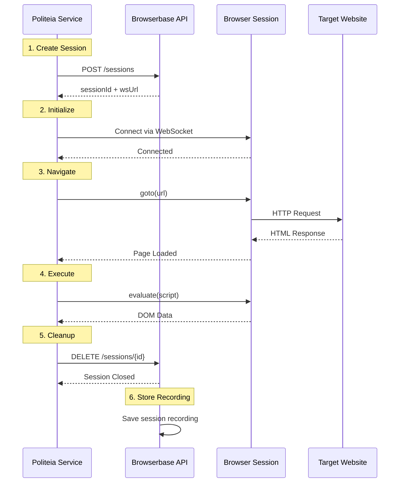

# Browserbase Session Management

Complete guide to managing Browserbase browser sessions in Politeia.

---

## Overview

**Browserbase** provides managed browser infrastructure, eliminating the need to host browsers yourself.

### Key Benefits
- ✅ No infrastructure management
- ✅ Auto-scaling sessions
- ✅ Built-in debugging tools
- ✅ Session recordings
- ✅ Global CDN

---

## Session Lifecycle



---

## Creating Sessions

### Basic Session Creation

```typescript
import { V3 as Stagehand } from '@browserbasehq/stagehand';

const stagehand = new Stagehand({
  env: 'BROWSERBASE',
  apiKey: process.env.BROWSERBASE_API_KEY,
  projectId: process.env.BROWSERBASE_PROJECT_ID,
  verbose: 1,
  enableCache: false
});

await stagehand.init();
```

### Session Configuration

```typescript
const stagehand = new Stagehand({
  env: 'BROWSERBASE',
  apiKey: process.env.BROWSERBASE_API_KEY,
  projectId: process.env.BROWSERBASE_PROJECT_ID,

  // Logging
  verbose: 1,  // 0 = off, 1 = basic, 2 = detailed

  // Caching
  enableCache: false,  // Disable for production

  // Timeout
  timeout: 60000,  // 60 seconds

  // Browser options
  browserOptions: {
    headless: true,
    viewport: { width: 1920, height: 1080 }
  }
});
```

### Advanced Configuration

```typescript
// With custom headers
const stagehand = new Stagehand({
  env: 'BROWSERBASE',
  apiKey: process.env.BROWSERBASE_API_KEY,
  projectId: process.env.BROWSERBASE_PROJECT_ID,

  // Custom user agent
  userAgent: 'Politeia/1.0 (Municipal Data Scraper)',

  // Proxy configuration (if needed)
  proxy: {
    server: 'proxy.example.com:8080',
    username: 'user',
    password: 'pass'
  }
});
```

---

## Session Info & Tracking

### Get Session Information

```typescript
await stagehand.init();

// Access session details
const context = (stagehand as any).context;
const sessionId = context._sessionId;
const sessionUrl = `https://www.browserbase.com/sessions/${sessionId}`;
const debugUrl = context._debugUrl;

console.log('Session Info:', {
  sessionId,
  sessionUrl,  // View in Browserbase dashboard
  debugUrl     // Live debugging URL
});
```

### Session URLs

| URL Type | Purpose | Example |
|----------|---------|---------|
| **Session URL** | View recording after completion | `https://browserbase.com/sessions/abc123` |
| **Debug URL** | Live debugging during execution | `https://browserbase.com/devtools/inspector.html?wss=...` |
| **WebSocket URL** | Connection endpoint | `wss://connect.browserbase.com/...` |

---

## Page Operations

### Navigation

```typescript
const page = stagehand.context.pages()[0];

// Navigate to URL
await page.goto('https://example.com', {
  waitUntil: 'networkidle',  // Wait for network to be idle
  timeout: 30000
});

// Navigate with specific wait conditions
await page.goto('https://example.com', {
  waitUntil: 'load',  // or 'domcontentloaded', 'networkidle'
});

// Reload page
await page.reload({ waitUntil: 'networkidle' });

// Go back/forward
await page.goBack();
await page.goForward();
```

### Waiting Strategies

```typescript
// Wait for selector
await page.waitForSelector('#content', { timeout: 10000 });

// Wait for navigation
await page.waitForNavigation({ waitUntil: 'networkidle' });

// Wait for timeout (last resort)
await page.waitForTimeout(3000);  // 3 seconds

// Wait for function
await page.waitForFunction(() => {
  return document.querySelectorAll('.meeting-item').length > 0;
});
```

---

## Data Extraction

### DOM Evaluation

```typescript
// Extract data from page
const meetings = await page.evaluate(() => {
  const links = document.querySelectorAll('a[href*="/Agenda/Index/"]');

  return Array.from(links).map(link => ({
    id: link.href.match(/\/Agenda\/Index\/([a-f0-9-]+)/i)?.[1],
    title: link.textContent?.trim(),
    url: link.href
  }));
});

console.log(`Found ${meetings.length} meetings`);
```

### Passing Data to Page Context

```typescript
// Pass configuration to page
const config = {
  selectors: {
    meetingLinks: 'a.meeting',
    title: '.title'
  }
};

const results = await page.evaluate((cfg) => {
  const links = document.querySelectorAll(cfg.selectors.meetingLinks);
  return Array.from(links).map(link => ({
    title: link.querySelector(cfg.selectors.title)?.textContent
  }));
}, config);
```

### Handle Dynamic Content

```typescript
// Wait for AJAX to complete
await page.waitForSelector('.loading', { state: 'hidden' });
await page.waitForSelector('.content', { state: 'visible' });

// Or wait for specific network requests
await page.waitForResponse(
  response => response.url().includes('/api/meetings') && response.status() === 200
);
```

---

## Interaction

### Dropdowns & Forms

```typescript
// Select from dropdown (Playwright-style)
await page.locator('#CurrentMonth').selectOption('9');  // October (0-indexed)
await page.locator('#CurrentYear').selectOption('2025');

// Alternative: native select
await page.selectOption('#CurrentMonth', '9');

// Click elements
await page.click('button.submit');

// Type text
await page.fill('input[name="search"]', 'query');

// Check/uncheck
await page.check('input[type="checkbox"]');
await page.uncheck('input[type="checkbox"]');
```

### File Upload

```typescript
// Upload file
await page.setInputFiles('input[type="file"]', 'path/to/file.pdf');

// Multiple files
await page.setInputFiles('input[type="file"]', [
  'file1.pdf',
  'file2.pdf'
]);
```

---

## Session Cleanup

### Proper Cleanup

```typescript
try {
  await stagehand.init();
  const page = stagehand.context.pages()[0];

  // ... perform scraping ...

} finally {
  // ALWAYS close session
  await stagehand.close();
}
```

### With Session Tracking

```typescript
class SessionManager {
  private activeSessions: Map<string, Stagehand> = new Map();

  async createSession(requestId: string): Promise<Stagehand> {
    const stagehand = new Stagehand({ /* config */ });
    await stagehand.init();

    this.activeSessions.set(requestId, stagehand);
    return stagehand;
  }

  async closeSession(requestId: string) {
    const stagehand = this.activeSessions.get(requestId);
    if (stagehand) {
      await stagehand.close();
      this.activeSessions.delete(requestId);
    }
  }

  async closeAll() {
    for (const [id, stagehand] of this.activeSessions) {
      await stagehand.close();
    }
    this.activeSessions.clear();
  }
}
```

---

## Error Handling

### Common Errors & Solutions

#### 1. Session Creation Failed

```typescript
try {
  await stagehand.init();
} catch (error) {
  if (error.message.includes('BROWSERBASE_API_KEY')) {
    console.error('Invalid API key');
  } else if (error.message.includes('quota exceeded')) {
    console.error('Session quota exceeded');
    // Wait and retry
    await sleep(60000);
  } else {
    throw error;
  }
}
```

#### 2. Navigation Timeout

```typescript
try {
  await page.goto(url, { timeout: 30000 });
} catch (error) {
  if (error.name === 'TimeoutError') {
    console.warn('Navigation timeout, retrying...');
    await page.goto(url, { timeout: 60000 });
  } else {
    throw error;
  }
}
```

#### 3. Selector Not Found

```typescript
try {
  await page.waitForSelector('#content', { timeout: 10000 });
} catch (error) {
  console.warn('Selector not found, trying fallback...');
  await page.waitForSelector('.content, #main', { timeout: 10000 });
}
```

### Retry Logic

```typescript
async function withRetry<T>(
  fn: () => Promise<T>,
  maxRetries: number = 3,
  backoffMs: number = 1000
): Promise<T> {
  for (let i = 0; i < maxRetries; i++) {
    try {
      return await fn();
    } catch (error) {
      if (i === maxRetries - 1) throw error;

      console.warn(`Attempt ${i + 1} failed, retrying...`);
      await sleep(backoffMs * Math.pow(2, i));
    }
  }
  throw new Error('Max retries exceeded');
}

// Usage
const meetings = await withRetry(() =>
  page.evaluate(() => /* extract meetings */)
);
```

---

## Performance Optimization

### Disable Unnecessary Resources

```typescript
// Block images/fonts to speed up loading
await page.route('**/*.{png,jpg,jpeg,gif,svg,woff,woff2}', route => {
  route.abort();
});

// Block specific domains
await page.route('**/google-analytics.com/**', route => route.abort());
await page.route('**/facebook.com/**', route => route.abort());
```

### Concurrent Sessions

```typescript
// Process multiple municipalities in parallel
async function scrapeMultiple(municipalities: Municipality[]) {
  const promises = municipalities.map(async (muni) => {
    const stagehand = new Stagehand({ /* config */ });
    try {
      await stagehand.init();
      return await scrape(stagehand, muni);
    } finally {
      await stagehand.close();
    }
  });

  return await Promise.all(promises);
}
```

### Session Pooling

```typescript
class SessionPool {
  private pool: Stagehand[] = [];
  private maxSize = 5;

  async acquire(): Promise<Stagehand> {
    if (this.pool.length > 0) {
      return this.pool.pop()!;
    }

    const stagehand = new Stagehand({ /* config */ });
    await stagehand.init();
    return stagehand;
  }

  async release(stagehand: Stagehand) {
    if (this.pool.length < this.maxSize) {
      this.pool.push(stagehand);
    } else {
      await stagehand.close();
    }
  }
}
```

---

## Monitoring & Debugging

### Session Logging

```typescript
// Enable detailed logging
const stagehand = new Stagehand({
  env: 'BROWSERBASE',
  apiKey: process.env.BROWSERBASE_API_KEY,
  projectId: process.env.BROWSERBASE_PROJECT_ID,
  verbose: 2  // Detailed logs
});

// Custom logging
page.on('console', msg => {
  console.log('[Browser Console]', msg.text());
});

page.on('pageerror', error => {
  console.error('[Page Error]', error.message);
});

page.on('requestfailed', request => {
  console.warn('[Request Failed]', request.url());
});
```

### Live Debugging

```typescript
await stagehand.init();
const debugUrl = (stagehand as any).context._debugUrl;

console.log('Live debug URL:', debugUrl);
// Open this URL in your browser to debug live
```

### Screenshots

```typescript
// Take screenshot for debugging
await page.screenshot({
  path: 'debug-screenshot.png',
  fullPage: true
});

// Screenshot specific element
const element = await page.$('#content');
await element.screenshot({ path: 'element.png' });
```

---

## Best Practices

### ✅ Do's

1. **Always close sessions**
   ```typescript
   try {
     await stagehand.init();
     // ... work ...
   } finally {
     await stagehand.close();
   }
   ```

2. **Use appropriate wait strategies**
   ```typescript
   await page.waitForSelector('#content');  // ✅ Good
   await page.waitForTimeout(5000);         // ❌ Avoid
   ```

3. **Handle errors gracefully**
   ```typescript
   try {
     // ... scraping ...
   } catch (error) {
     await stagehand.close();
     throw error;
   }
   ```

4. **Track sessions**
   ```typescript
   const sessionId = context._sessionId;
   logger.info('Session created', { sessionId });
   ```

### ❌ Don'ts

1. **Don't leave sessions open**
   ```typescript
   await stagehand.init();
   // ... work ...
   // ❌ Missing stagehand.close()
   ```

2. **Don't use arbitrary timeouts**
   ```typescript
   await page.waitForTimeout(10000);  // ❌ Bad
   ```

3. **Don't ignore errors**
   ```typescript
   try {
     await page.goto(url);
   } catch (error) {
     // ❌ Silent failure
   }
   ```

---

## Cost Management

### Session Duration

```typescript
// Track session duration
const startTime = Date.now();
await stagehand.init();

// ... perform scraping ...

await stagehand.close();
const duration = Date.now() - startTime;

console.log(`Session duration: ${duration}ms`);
// Bill based on duration
```

### Optimize for Cost

1. **Keep sessions short** - Close as soon as done
2. **Reuse sessions** - Pool for multiple operations
3. **Disable unnecessary features** - Block images/ads
4. **Use caching** - Cache repeated scrapes (development only)

---

## Related Documentation

- [Logging](./logging.md)
- [Error Handling](./error-handling.md)
- [Best Practices](./best-practices.md)
- [API Reference](../03-api/external-api.md)

---

[← Back to Documentation Index](../README.md)
