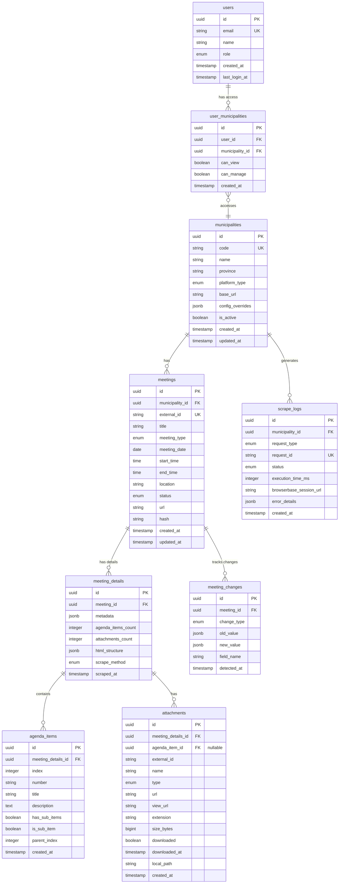

# Supabase Database Schema

Complete database schema for the external system that uses Politeia.

---

## Overview

The external system uses **Supabase (PostgreSQL)** to store:
- Municipality configurations
- Scraped meetings data
- Change history
- Scraping logs
- User access control

---

## ER Diagram



---

## Tables

### 1. municipalities

Municipality configurations.

```sql
CREATE TABLE municipalities (
  id UUID PRIMARY KEY DEFAULT gen_random_uuid(),
  code VARCHAR(50) UNIQUE NOT NULL,  -- e.g., 'oirschot'
  name VARCHAR(255) NOT NULL,        -- e.g., 'Oirschot'
  province VARCHAR(100),
  platform_type VARCHAR(50) NOT NULL,  -- 'NOTUBIZ', 'IBIS', 'CUSTOM'
  base_url VARCHAR(500) NOT NULL,
  config_overrides JSONB DEFAULT '{}',
  is_active BOOLEAN DEFAULT true,
  created_at TIMESTAMP WITH TIME ZONE DEFAULT NOW(),
  updated_at TIMESTAMP WITH TIME ZONE DEFAULT NOW()
);

CREATE INDEX idx_municipalities_code ON municipalities(code);
CREATE INDEX idx_municipalities_platform ON municipalities(platform_type);
CREATE INDEX idx_municipalities_active ON municipalities(is_active);
```

**Example Data:**
```sql
INSERT INTO municipalities (code, name, province, platform_type, base_url) VALUES
('oirschot', 'Oirschot', 'Noord-Brabant', 'NOTUBIZ', 'https://oirschot.bestuurlijkeinformatie.nl'),
('best', 'Best', 'Noord-Brabant', 'NOTUBIZ', 'https://best.bestuurlijkeinformatie.nl'),
('amsterdam', 'Amsterdam', 'Noord-Holland', 'IBIS', 'https://amsterdam.ibabs.eu');
```

---

### 2. meetings

Basic meeting information.

```sql
CREATE TABLE meetings (
  id UUID PRIMARY KEY DEFAULT gen_random_uuid(),
  municipality_id UUID NOT NULL REFERENCES municipalities(id) ON DELETE CASCADE,
  external_id VARCHAR(100) NOT NULL,  -- Meeting ID from source system
  title TEXT NOT NULL,
  meeting_type VARCHAR(100),  -- 'Commissievergadering', 'Raadsbijeenkomst', etc.
  meeting_date DATE NOT NULL,
  start_time TIME,
  end_time TIME,
  location VARCHAR(255),
  status VARCHAR(50) DEFAULT 'scheduled',  -- 'scheduled', 'cancelled', 'completed'
  url VARCHAR(1000) NOT NULL,
  hash VARCHAR(64) NOT NULL,  -- SHA-256 for change detection
  created_at TIMESTAMP WITH TIME ZONE DEFAULT NOW(),
  updated_at TIMESTAMP WITH TIME ZONE DEFAULT NOW(),

  UNIQUE(municipality_id, external_id)
);

CREATE INDEX idx_meetings_municipality ON meetings(municipality_id);
CREATE INDEX idx_meetings_date ON meetings(meeting_date);
CREATE INDEX idx_meetings_status ON meetings(status);
CREATE INDEX idx_meetings_type ON meetings(meeting_type);
CREATE INDEX idx_meetings_hash ON meetings(hash);
```

**Example Data:**
```sql
INSERT INTO meetings (
  municipality_id,
  external_id,
  title,
  meeting_type,
  meeting_date,
  start_time,
  end_time,
  location,
  url,
  hash
) VALUES (
  '...uuid...',
  'b465214f-a570-45ba-85b9-c4d02bc5b107',
  'Auditcommissie',
  'Commissievergadering',
  '2025-10-07',
  '19:30',
  '21:00',
  'Commissiekamer beneden',
  'https://oirschot.bestuurlijkeinformatie.nl/Agenda/Index/b465214f-a570-45ba-85b9-c4d02bc5b107',
  'sha256-hash-here'
);
```

---

### 3. meeting_details

Detailed meeting information.

```sql
CREATE TABLE meeting_details (
  id UUID PRIMARY KEY DEFAULT gen_random_uuid(),
  meeting_id UUID NOT NULL REFERENCES meetings(id) ON DELETE CASCADE,
  metadata JSONB DEFAULT '{}',  -- Key-value pairs from <dl>
  agenda_items_count INTEGER DEFAULT 0,
  attachments_count INTEGER DEFAULT 0,
  html_structure JSONB DEFAULT '{}',  -- hasMainContent, hasAgendaList, etc.
  scrape_method VARCHAR(50) DEFAULT 'dom',  -- 'dom', 'api', 'hybrid'
  scraped_at TIMESTAMP WITH TIME ZONE DEFAULT NOW(),

  UNIQUE(meeting_id)
);

CREATE INDEX idx_meeting_details_meeting ON meeting_details(meeting_id);
```

**Example Data:**
```sql
INSERT INTO meeting_details (
  meeting_id,
  metadata,
  agenda_items_count,
  attachments_count,
  html_structure
) VALUES (
  '...meeting-uuid...',
  '{"Locatie": "Commissiekamer beneden", "Voorzitter": "M. van Leeuwen"}',
  11,
  6,
  '{"hasMainContent": true, "hasBreadcrumb": true, "hasAgendaList": true}'
);
```

---

### 4. agenda_items

Meeting agenda items.

```sql
CREATE TABLE agenda_items (
  id UUID PRIMARY KEY DEFAULT gen_random_uuid(),
  meeting_details_id UUID NOT NULL REFERENCES meeting_details(id) ON DELETE CASCADE,
  index INTEGER NOT NULL,  -- Order in agenda
  number VARCHAR(50),      -- e.g., '1', '2.A', '3.1'
  title TEXT NOT NULL,
  description TEXT,
  has_sub_items BOOLEAN DEFAULT false,
  is_sub_item BOOLEAN DEFAULT false,
  parent_index INTEGER,  -- Index of parent item (if nested)
  created_at TIMESTAMP WITH TIME ZONE DEFAULT NOW(),

  UNIQUE(meeting_details_id, index)
);

CREATE INDEX idx_agenda_items_meeting_details ON agenda_items(meeting_details_id);
CREATE INDEX idx_agenda_items_parent ON agenda_items(parent_index);
```

---

### 5. attachments

Meeting attachments and documents.

```sql
CREATE TABLE attachments (
  id UUID PRIMARY KEY DEFAULT gen_random_uuid(),
  meeting_details_id UUID NOT NULL REFERENCES meeting_details(id) ON DELETE CASCADE,
  agenda_item_id UUID REFERENCES agenda_items(id) ON DELETE SET NULL,  -- Nullable
  external_id VARCHAR(100) NOT NULL,  -- Document ID from source
  name TEXT NOT NULL,
  type VARCHAR(50) NOT NULL,  -- 'pdf', 'word', 'excel', 'document'
  url VARCHAR(1000) NOT NULL,
  view_url VARCHAR(1000),
  extension VARCHAR(20),
  size_bytes BIGINT,
  downloaded BOOLEAN DEFAULT false,
  downloaded_at TIMESTAMP WITH TIME ZONE,
  local_path VARCHAR(500),
  created_at TIMESTAMP WITH TIME ZONE DEFAULT NOW()
);

CREATE INDEX idx_attachments_meeting_details ON attachments(meeting_details_id);
CREATE INDEX idx_attachments_agenda_item ON attachments(agenda_item_id);
CREATE INDEX idx_attachments_type ON attachments(type);
CREATE INDEX idx_attachments_downloaded ON attachments(downloaded);
```

---

### 6. meeting_changes

Change history for meetings.

```sql
CREATE TABLE meeting_changes (
  id UUID PRIMARY KEY DEFAULT gen_random_uuid(),
  meeting_id UUID NOT NULL REFERENCES meetings(id) ON DELETE CASCADE,
  change_type VARCHAR(50) NOT NULL,  -- 'created', 'modified', 'cancelled', 'removed'
  field_name VARCHAR(100),           -- e.g., 'date', 'time', 'status'
  old_value JSONB,
  new_value JSONB,
  detected_at TIMESTAMP WITH TIME ZONE DEFAULT NOW()
);

CREATE INDEX idx_meeting_changes_meeting ON meeting_changes(meeting_id);
CREATE INDEX idx_meeting_changes_type ON meeting_changes(change_type);
CREATE INDEX idx_meeting_changes_detected ON meeting_changes(detected_at DESC);
```

**Example Data:**
```sql
INSERT INTO meeting_changes (
  meeting_id,
  change_type,
  field_name,
  old_value,
  new_value
) VALUES (
  '...uuid...',
  'modified',
  'date',
  '"2025-10-07"',
  '"2025-10-08"'
);
```

---

### 7. scrape_logs

Scraping execution logs.

```sql
CREATE TABLE scrape_logs (
  id UUID PRIMARY KEY DEFAULT gen_random_uuid(),
  municipality_id UUID REFERENCES municipalities(id) ON DELETE SET NULL,
  request_type VARCHAR(50) NOT NULL,  -- 'meetings-list', 'meeting-details'
  request_id VARCHAR(100) UNIQUE NOT NULL,
  status VARCHAR(50) NOT NULL,  -- 'success', 'error'
  execution_time_ms INTEGER,
  browserbase_session_url VARCHAR(500),
  error_details JSONB,
  created_at TIMESTAMP WITH TIME ZONE DEFAULT NOW()
);

CREATE INDEX idx_scrape_logs_municipality ON scrape_logs(municipality_id);
CREATE INDEX idx_scrape_logs_status ON scrape_logs(status);
CREATE INDEX idx_scrape_logs_created ON scrape_logs(created_at DESC);
CREATE INDEX idx_scrape_logs_request_id ON scrape_logs(request_id);
```

---

### 8. users

User accounts (optional - for multi-tenant).

```sql
CREATE TABLE users (
  id UUID PRIMARY KEY DEFAULT gen_random_uuid(),
  email VARCHAR(255) UNIQUE NOT NULL,
  name VARCHAR(255),
  role VARCHAR(50) DEFAULT 'viewer',  -- 'admin', 'manager', 'viewer'
  created_at TIMESTAMP WITH TIME ZONE DEFAULT NOW(),
  last_login_at TIMESTAMP WITH TIME ZONE
);

CREATE INDEX idx_users_email ON users(email);
CREATE INDEX idx_users_role ON users(role);
```

---

### 9. user_municipalities

User access control per municipality.

```sql
CREATE TABLE user_municipalities (
  id UUID PRIMARY KEY DEFAULT gen_random_uuid(),
  user_id UUID NOT NULL REFERENCES users(id) ON DELETE CASCADE,
  municipality_id UUID NOT NULL REFERENCES municipalities(id) ON DELETE CASCADE,
  can_view BOOLEAN DEFAULT true,
  can_manage BOOLEAN DEFAULT false,
  created_at TIMESTAMP WITH TIME ZONE DEFAULT NOW(),

  UNIQUE(user_id, municipality_id)
);

CREATE INDEX idx_user_municipalities_user ON user_municipalities(user_id);
CREATE INDEX idx_user_municipalities_municipality ON user_municipalities(municipality_id);
```

---

## Functions & Triggers

### Auto-update updated_at

```sql
CREATE OR REPLACE FUNCTION update_updated_at_column()
RETURNS TRIGGER AS $$
BEGIN
   NEW.updated_at = NOW();
   RETURN NEW;
END;
$$ LANGUAGE plpgsql;

CREATE TRIGGER update_municipalities_updated_at
  BEFORE UPDATE ON municipalities
  FOR EACH ROW
  EXECUTE FUNCTION update_updated_at_column();

CREATE TRIGGER update_meetings_updated_at
  BEFORE UPDATE ON meetings
  FOR EACH ROW
  EXECUTE FUNCTION update_updated_at_column();
```

### Calculate Hash

```sql
CREATE OR REPLACE FUNCTION calculate_meeting_hash(meeting_row meetings)
RETURNS VARCHAR(64) AS $$
BEGIN
  RETURN encode(
    digest(
      meeting_row.title || meeting_row.meeting_date::text ||
      meeting_row.start_time::text || meeting_row.status,
      'sha256'
    ),
    'hex'
  );
END;
$$ LANGUAGE plpgsql;
```

---

## Queries

### Get Municipalities with Meeting Counts

```sql
SELECT
  m.id,
  m.code,
  m.name,
  m.platform_type,
  COUNT(mt.id) as meetings_count,
  COUNT(CASE WHEN mt.meeting_date >= CURRENT_DATE THEN 1 END) as upcoming_meetings
FROM municipalities m
LEFT JOIN meetings mt ON m.id = mt.municipality_id
WHERE m.is_active = true
GROUP BY m.id, m.code, m.name, m.platform_type
ORDER BY m.name;
```

### Get Recent Changes

```sql
SELECT
  mc.id,
  m.title as meeting_title,
  muni.name as municipality,
  mc.change_type,
  mc.field_name,
  mc.old_value,
  mc.new_value,
  mc.detected_at
FROM meeting_changes mc
JOIN meetings m ON mc.meeting_id = m.id
JOIN municipalities muni ON m.municipality_id = muni.id
WHERE mc.detected_at >= NOW() - INTERVAL '7 days'
ORDER BY mc.detected_at DESC
LIMIT 50;
```

### Get Meetings with Details

```sql
SELECT
  m.*,
  md.metadata,
  md.agenda_items_count,
  md.attachments_count,
  md.scraped_at
FROM meetings m
LEFT JOIN meeting_details md ON m.id = md.meeting_id
WHERE m.municipality_id = '...uuid...'
  AND m.meeting_date >= CURRENT_DATE
ORDER BY m.meeting_date, m.start_time;
```

---

## Row Level Security (RLS)

### Enable RLS

```sql
ALTER TABLE municipalities ENABLE ROW LEVEL SECURITY;
ALTER TABLE meetings ENABLE ROW LEVEL SECURITY;
ALTER TABLE meeting_details ENABLE ROW LEVEL SECURITY;

-- Users can only see municipalities they have access to
CREATE POLICY user_municipalities_policy ON municipalities
FOR SELECT
USING (
  id IN (
    SELECT municipality_id
    FROM user_municipalities
    WHERE user_id = auth.uid()
      AND can_view = true
  )
);

-- Users can only see meetings from their municipalities
CREATE POLICY user_meetings_policy ON meetings
FOR SELECT
USING (
  municipality_id IN (
    SELECT municipality_id
    FROM user_municipalities
    WHERE user_id = auth.uid()
      AND can_view = true
  )
);
```

---

## Migrations

### Initial Setup

```sql
-- migrations/001_initial_schema.sql
-- Run all CREATE TABLE statements
```

### Add Indexes

```sql
-- migrations/002_add_indexes.sql
-- Run all CREATE INDEX statements
```

### Add Functions

```sql
-- migrations/003_add_functions.sql
-- Run trigger and function definitions
```

---

## Backup Strategy

### Daily Backups

```sql
-- Supabase automatic daily backups (last 7 days)
```

### Export Data

```bash
# Export specific tables
pg_dump -h db.xxx.supabase.co \
  -U postgres \
  -d postgres \
  -t meetings -t municipalities \
  > backup.sql
```

---

## Performance Optimization

### Vacuum & Analyze

```sql
-- Run regularly
VACUUM ANALYZE meetings;
VACUUM ANALYZE meeting_details;
```

### Query Optimization

```sql
-- Use EXPLAIN to analyze queries
EXPLAIN ANALYZE
SELECT * FROM meetings
WHERE municipality_id = '...uuid...'
  AND meeting_date >= CURRENT_DATE;
```

---

## Related Documentation

- [Entities](./entities.md)
- [Relationships](./relationships.md)
- [API Reference](../03-api/external-api.md)

---

[← Back to Documentation Index](../README.md)
