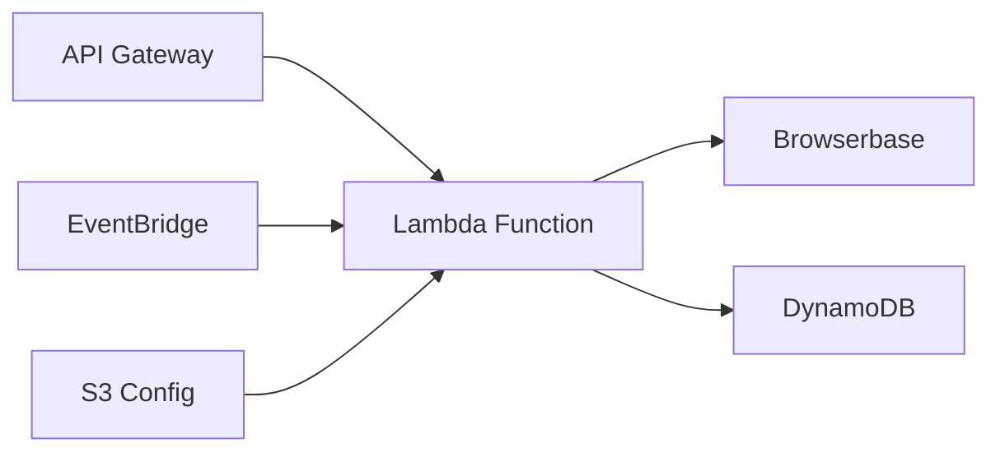

# Serverless Deployment

Deploy Politeia on serverless platforms for cost-effective, auto-scaling scraping.

---

## Overview

Serverless deployment offers:
- ✅ Zero infrastructure management
- ✅ Pay-per-execution pricing
- ✅ Automatic scaling
- ✅ Built-in high availability
- ✅ Global distribution

**Best For:**
- Low to medium traffic
- Unpredictable workloads
- Cost optimization
- Rapid deployment

---

## AWS Lambda Deployment

### Architecture



### Lambda Function Setup

#### 1. Package Application

```javascript
// lambda/handler.js
const { scrapeMeetingsList, scrapeMeetingDetails } = require('./politeia');

exports.handler = async (event) => {
  console.log('Event:', JSON.stringify(event));

  try {
    // Parse request
    const request = JSON.parse(event.body || '{}');
    const { requestType, municipality, parameters } = request;

    let result;
    if (requestType === 'meetings-list') {
      result = await scrapeMeetingsList(municipality, parameters);
    } else if (requestType === 'meeting-details') {
      result = await scrapeMeetingDetails(municipality, request.meetingId);
    } else {
      throw new Error(`Unknown request type: ${requestType}`);
    }

    return {
      statusCode: 200,
      headers: {
        'Content-Type': 'application/json',
        'Access-Control-Allow-Origin': '*'
      },
      body: JSON.stringify({
        requestId: request.requestId,
        status: 'success',
        timestamp: new Date().toISOString(),
        data: result
      })
    };

  } catch (error) {
    console.error('Error:', error);

    return {
      statusCode: 500,
      headers: {
        'Content-Type': 'application/json',
        'Access-Control-Allow-Origin': '*'
      },
      body: JSON.stringify({
        requestId: event.requestId,
        status: 'error',
        error: {
          code: 'SCRAPING_FAILED',
          message: error.message
        }
      })
    };
  }
};
```

#### 2. Package Dependencies

```bash
# Install dependencies
npm install --production

# Create deployment package
zip -r politeia-lambda.zip . -x "*.git*" "node_modules/aws-sdk/*"

# For large packages, use Lambda Layers
mkdir -p layers/nodejs
cd layers/nodejs
npm install @browserbasehq/stagehand cheerio
cd ../..
zip -r politeia-layer.zip layers/
```

#### 3. Terraform Configuration

```hcl
# terraform/lambda.tf
resource "aws_lambda_function" "politeia" {
  function_name = "politeia-scraper"
  filename      = "politeia-lambda.zip"
  handler       = "handler.handler"
  runtime       = "nodejs18.x"
  role          = aws_iam_role.lambda_role.arn
  timeout       = 60
  memory_size   = 1024

  environment {
    variables = {
      NODE_ENV                 = "production"
      BROWSERBASE_API_KEY      = var.browserbase_api_key
      BROWSERBASE_PROJECT_ID   = var.browserbase_project_id
      CONFIG_BUCKET            = aws_s3_bucket.config.id
    }
  }

  layers = [
    aws_lambda_layer_version.dependencies.arn
  ]

  vpc_config {
    subnet_ids         = var.subnet_ids
    security_group_ids = [aws_security_group.lambda.id]
  }
}

resource "aws_lambda_layer_version" "dependencies" {
  layer_name          = "politeia-dependencies"
  filename            = "politeia-layer.zip"
  compatible_runtimes = ["nodejs18.x"]
}

resource "aws_iam_role" "lambda_role" {
  name = "politeia-lambda-role"

  assume_role_policy = jsonencode({
    Version = "2012-10-17"
    Statement = [{
      Action = "sts:AssumeRole"
      Effect = "Allow"
      Principal = {
        Service = "lambda.amazonaws.com"
      }
    }]
  })
}

resource "aws_iam_role_policy_attachment" "lambda_basic" {
  role       = aws_iam_role.lambda_role.name
  policy_arn = "arn:aws:iam::aws:policy/service-role/AWSLambdaBasicExecutionRole"
}
```

#### 4. API Gateway

```hcl
# terraform/api-gateway.tf
resource "aws_apigatewayv2_api" "politeia" {
  name          = "politeia-api"
  protocol_type = "HTTP"
}

resource "aws_apigatewayv2_integration" "lambda" {
  api_id             = aws_apigatewayv2_api.politeia.id
  integration_type   = "AWS_PROXY"
  integration_uri    = aws_lambda_function.politeia.invoke_arn
  integration_method = "POST"
  payload_format_version = "2.0"
}

resource "aws_apigatewayv2_route" "scrape" {
  api_id    = aws_apigatewayv2_api.politeia.id
  route_key = "POST /api/scrape/{requestType}"
  target    = "integrations/${aws_apigatewayv2_integration.lambda.id}"
}

resource "aws_apigatewayv2_stage" "prod" {
  api_id      = aws_apigatewayv2_api.politeia.id
  name        = "prod"
  auto_deploy = true

  access_log_settings {
    destination_arn = aws_cloudwatch_log_group.api_gateway.arn
    format = jsonencode({
      requestId      = "$context.requestId"
      ip             = "$context.identity.sourceIp"
      requestTime    = "$context.requestTime"
      httpMethod     = "$context.httpMethod"
      routeKey       = "$context.routeKey"
      status         = "$context.status"
      protocol       = "$context.protocol"
      responseLength = "$context.responseLength"
    })
  }
}

resource "aws_lambda_permission" "api_gateway" {
  statement_id  = "AllowAPIGatewayInvoke"
  action        = "lambda:InvokeFunction"
  function_name = aws_lambda_function.politeia.function_name
  principal     = "apigateway.amazonaws.com"
  source_arn    = "${aws_apigatewayv2_api.politeia.execution_arn}/*/*"
}
```

#### 5. Deploy

```bash
# Initialize Terraform
terraform init

# Plan deployment
terraform plan

# Deploy
terraform apply

# Get API endpoint
terraform output api_endpoint
```

---

## Google Cloud Functions

### Function Setup

```javascript
// index.js
const functions = require('@google-cloud/functions-framework');
const { scrapeMeetingsList, scrapeMeetingDetails } = require('./politeia');

functions.http('politeiaScraper', async (req, res) => {
  // CORS
  res.set('Access-Control-Allow-Origin', '*');

  if (req.method === 'OPTIONS') {
    res.set('Access-Control-Allow-Methods', 'POST');
    res.set('Access-Control-Allow-Headers', 'Content-Type');
    res.status(204).send('');
    return;
  }

  try {
    const { requestType, municipality, parameters, meetingId } = req.body;

    let result;
    if (requestType === 'meetings-list') {
      result = await scrapeMeetingsList(municipality, parameters);
    } else if (requestType === 'meeting-details') {
      result = await scrapeMeetingDetails(municipality, meetingId);
    } else {
      throw new Error(`Unknown request type: ${requestType}`);
    }

    res.status(200).json({
      requestId: req.body.requestId,
      status: 'success',
      timestamp: new Date().toISOString(),
      data: result
    });

  } catch (error) {
    console.error('Error:', error);

    res.status(500).json({
      requestId: req.body.requestId,
      status: 'error',
      error: {
        code: 'SCRAPING_FAILED',
        message: error.message
      }
    });
  }
});
```

### Deploy to GCP

```bash
# Deploy function
gcloud functions deploy politeia-scraper \
  --runtime nodejs18 \
  --trigger-http \
  --allow-unauthenticated \
  --entry-point politeiaScraper \
  --timeout 60s \
  --memory 1GB \
  --set-env-vars BROWSERBASE_API_KEY=bb_xxx,BROWSERBASE_PROJECT_ID=prj_xxx

# Get function URL
gcloud functions describe politeia-scraper --format='value(httpsTrigger.url)'

# Test function
curl -X POST https://REGION-PROJECT.cloudfunctions.net/politeia-scraper \
  -H "Content-Type: application/json" \
  -d '{"requestType": "meetings-list", "municipality": {...}}'
```

### Terraform for GCP

```hcl
resource "google_cloudfunctions_function" "politeia" {
  name        = "politeia-scraper"
  runtime     = "nodejs18"
  entry_point = "politeiaScraper"

  available_memory_mb   = 1024
  timeout              = 60
  max_instances        = 100

  source_archive_bucket = google_storage_bucket.source.name
  source_archive_object = google_storage_bucket_object.source.name

  trigger_http = true

  environment_variables = {
    NODE_ENV                = "production"
    BROWSERBASE_API_KEY     = var.browserbase_api_key
    BROWSERBASE_PROJECT_ID  = var.browserbase_project_id
  }
}

resource "google_cloudfunctions_function_iam_member" "invoker" {
  project        = google_cloudfunctions_function.politeia.project
  region         = google_cloudfunctions_function.politeia.region
  cloud_function = google_cloudfunctions_function.politeia.name

  role   = "roles/cloudfunctions.invoker"
  member = "allUsers"
}
```

---

## Azure Functions

### Function App

```javascript
// HttpTrigger/index.js
module.exports = async function (context, req) {
  context.log('Politeia function triggered');

  try {
    const { requestType, municipality, parameters, meetingId } = req.body;

    let result;
    if (requestType === 'meetings-list') {
      result = await scrapeMeetingsList(municipality, parameters);
    } else if (requestType === 'meeting-details') {
      result = await scrapeMeetingDetails(municipality, meetingId);
    } else {
      throw new Error(`Unknown request type: ${requestType}`);
    }

    context.res = {
      status: 200,
      body: {
        requestId: req.body.requestId,
        status: 'success',
        timestamp: new Date().toISOString(),
        data: result
      }
    };

  } catch (error) {
    context.log.error('Error:', error);

    context.res = {
      status: 500,
      body: {
        requestId: req.body.requestId,
        status: 'error',
        error: {
          code: 'SCRAPING_FAILED',
          message: error.message
        }
      }
    };
  }
};
```

### Deploy to Azure

```bash
# Create resource group
az group create --name politeia-rg --location westeurope

# Create storage account
az storage account create \
  --name politeiast \
  --resource-group politeia-rg \
  --location westeurope

# Create function app
az functionapp create \
  --resource-group politeia-rg \
  --name politeia-scraper \
  --storage-account politeiast \
  --runtime node \
  --runtime-version 18 \
  --functions-version 4 \
  --consumption-plan-location westeurope

# Configure environment
az functionapp config appsettings set \
  --name politeia-scraper \
  --resource-group politeia-rg \
  --settings \
    BROWSERBASE_API_KEY=bb_xxx \
    BROWSERBASE_PROJECT_ID=prj_xxx

# Deploy
func azure functionapp publish politeia-scraper
```

---

## Cloudflare Workers

### Worker Script

```javascript
// worker.js
import { scrapeMeetingsList, scrapeMeetingDetails } from './politeia';

export default {
  async fetch(request, env) {
    // CORS
    if (request.method === 'OPTIONS') {
      return new Response(null, {
        headers: {
          'Access-Control-Allow-Origin': '*',
          'Access-Control-Allow-Methods': 'POST',
          'Access-Control-Allow-Headers': 'Content-Type'
        }
      });
    }

    try {
      const body = await request.json();
      const { requestType, municipality, parameters, meetingId } = body;

      let result;
      if (requestType === 'meetings-list') {
        result = await scrapeMeetingsList(municipality, parameters);
      } else if (requestType === 'meeting-details') {
        result = await scrapeMeetingDetails(municipality, meetingId);
      } else {
        throw new Error(`Unknown request type: ${requestType}`);
      }

      return new Response(JSON.stringify({
        requestId: body.requestId,
        status: 'success',
        timestamp: new Date().toISOString(),
        data: result
      }), {
        headers: {
          'Content-Type': 'application/json',
          'Access-Control-Allow-Origin': '*'
        }
      });

    } catch (error) {
      return new Response(JSON.stringify({
        requestId: body?.requestId,
        status: 'error',
        error: {
          code: 'SCRAPING_FAILED',
          message: error.message
        }
      }), {
        status: 500,
        headers: {
          'Content-Type': 'application/json',
          'Access-Control-Allow-Origin': '*'
        }
      });
    }
  }
};
```

### Deploy

```bash
# Install Wrangler
npm install -g wrangler

# Login
wrangler login

# Configure
cat > wrangler.toml <<EOF
name = "politeia-scraper"
main = "worker.js"
compatibility_date = "2023-01-01"

[env.production]
vars = { NODE_ENV = "production" }

[[env.production.secrets]]
BROWSERBASE_API_KEY = "bb_xxx"
BROWSERBASE_PROJECT_ID = "prj_xxx"
EOF

# Deploy
wrangler deploy
```

---

## Cost Comparison

### AWS Lambda

| Metric | Cost | Example |
|--------|------|---------|
| **Requests** | $0.20 per 1M | 1M requests = $0.20 |
| **Compute** | $0.0000166667/GB-sec | 1GB, 5s = $0.000083 |
| **Total per request** | ~$0.0001 | 10,000 requests/month = $1 |

### Google Cloud Functions

| Metric | Cost | Example |
|--------|------|---------|
| **Invocations** | $0.40 per 1M | 1M requests = $0.40 |
| **Compute** | $0.0000025/GB-sec | 1GB, 5s = $0.0000125 |
| **Total per request** | ~$0.00041 | 10,000 requests/month = $4.10 |

### Azure Functions

| Metric | Cost | Example |
|--------|------|---------|
| **Executions** | $0.20 per 1M | 1M requests = $0.20 |
| **Compute** | $0.000016/GB-sec | 1GB, 5s = $0.00008 |
| **Total per request** | ~$0.00028 | 10,000 requests/month = $2.80 |

**Verdict:** AWS Lambda is most cost-effective for Politeia.

---

## Scheduled Execution

### AWS EventBridge

```hcl
# Daily scraping schedule
resource "aws_cloudwatch_event_rule" "daily_scrape" {
  name                = "politeia-daily-scrape"
  description         = "Trigger daily scraping"
  schedule_expression = "cron(0 6 * * ? *)"  # 6 AM UTC daily
}

resource "aws_cloudwatch_event_target" "lambda" {
  rule      = aws_cloudwatch_event_rule.daily_scrape.name
  target_id = "PoliteiaScraper"
  arn       = aws_lambda_function.politeia.arn

  input = jsonencode({
    requestType = "meetings-list"
    municipality = {
      id          = "oirschot"
      platformType = "NOTUBIZ"
      baseUrl     = "https://oirschot.bestuurlijkeinformatie.nl"
    }
    parameters = {
      month = 10
      year  = 2025
    }
  })
}
```

### GCP Cloud Scheduler

```bash
# Create scheduler job
gcloud scheduler jobs create http politeia-daily \
  --schedule="0 6 * * *" \
  --uri="https://REGION-PROJECT.cloudfunctions.net/politeia-scraper" \
  --http-method=POST \
  --message-body='{"requestType":"meetings-list","municipality":{...}}'
```

---

## Best Practices

### 1. Cold Start Optimization

```javascript
// Keep connections warm
let browserbaseClient;

exports.handler = async (event) => {
  // Reuse client across invocations
  if (!browserbaseClient) {
    browserbaseClient = initializeBrowserbase();
  }

  // ... rest of handler
};
```

### 2. Timeout Management

```javascript
// Set timeout buffer
const LAMBDA_TIMEOUT = 60; // seconds
const SCRAPE_TIMEOUT = 55; // leave 5s buffer

async function scrapeWithTimeout(fn, timeout) {
  return Promise.race([
    fn(),
    new Promise((_, reject) =>
      setTimeout(() => reject(new Error('Timeout')), timeout * 1000)
    )
  ]);
}
```

### 3. Error Handling

```javascript
// Retry logic
async function scrapeWithRetry(fn, maxRetries = 2) {
  for (let i = 0; i < maxRetries; i++) {
    try {
      return await fn();
    } catch (error) {
      if (i === maxRetries - 1) throw error;
      await sleep(1000 * Math.pow(2, i)); // Exponential backoff
    }
  }
}
```

---

## Limitations

### Serverless Constraints

| Limitation | AWS Lambda | GCP Functions | Azure Functions |
|------------|------------|---------------|-----------------|
| **Max Timeout** | 15 minutes | 9 minutes | 10 minutes |
| **Max Memory** | 10 GB | 8 GB | 1.5 GB (Consumption) |
| **Cold Start** | ~1-3s | ~1-2s | ~2-4s |
| **Package Size** | 50 MB (zip) | 100 MB | 1.5 GB |

### Not Suitable For:
- ❌ Long-running scrapes (>10 minutes)
- ❌ High-frequency requests (>1000/min)
- ❌ Stateful operations
- ❌ WebSocket connections

---

## Related Documentation

- [Docker Deployment](./docker.md)
- [Kubernetes Deployment](./kubernetes.md)
- [Monitoring Guide](./monitoring.md)
- [Cost Optimization](../09-operations/scaling.md)

---

[← Back to Documentation Index](../README.md)
