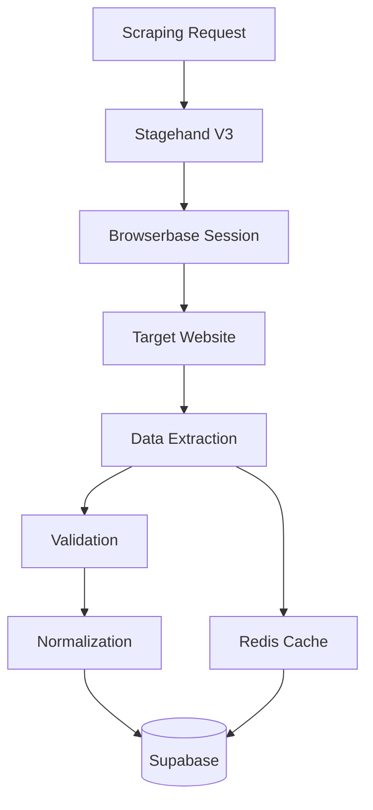

# Generic Web Scraping Extension

Extend Politeia to scrape any website or platform not covered by official APIs using Stagehand V3 and Browserbase.

---

## Overview

Generic scraping enables monitoring of:
- ✅ Municipal websites without APIs
- ✅ News sites and media outlets
- ✅ Government portals
- ✅ Discussion forums
- ✅ Custom platforms
- ✅ Legacy systems

**Use Cases:**
- Scrape municipality websites without APIs
- Monitor government press releases
- Track local news mentions
- Archive public announcements
- Extract data from custom platforms

---

## When to Use Generic Scraping

### ✅ Good Use Cases

- **No API Available** - Platform doesn't provide an API
- **API Too Limited** - API doesn't expose needed data
- **Public Content** - Data is publicly accessible
- **Research/Archival** - For academic or archival purposes

### ❌ Bad Use Cases

- **API Available** - Use the official API instead
- **Authentication Required** - Avoid scraping behind login
- **Real-Time Data** - APIs are more reliable for real-time
- **High Frequency** - Scraping is slower and more expensive
- **Against ToS** - Always respect Terms of Service

---

## Architecture

### Scraping Flow



---

## Platform Configuration Template

```yaml
# config/platforms/custom-municipality/v1.0.0.yaml
platform:
  type: CUSTOM
  version: "1.0.0"
  vendor: "Municipality Name"

baseUrl: "https://example.gemeente.nl"

features:
  - meetings-list
  - meeting-details
  - documents
  - agenda-items

navigation:
  meetingsListUrl: "/raad/vergaderingen"
  meetingDetailPattern: "/raad/vergadering/{id}"

selectors:
  meetingsList:
    container: ".meetings-list"
    meeting:
      selector: ".meeting-item"
      title: ".meeting-title"
      date: ".meeting-date"
      time: ".meeting-time"
      location: ".meeting-location"
      link: "a.meeting-link"

  meetingDetails:
    title: "h1.meeting-title"
    date: ".meeting-date"
    time: ".meeting-time"
    status: ".meeting-status"
    location: ".meeting-location"

    agendaItems:
      container: ".agenda-items"
      item:
        selector: ".agenda-item"
        number: ".item-number"
        title: ".item-title"
        description: ".item-description"

    documents:
      container: ".documents"
      document:
        selector: ".document-item"
        title: ".document-title"
        type: ".document-type"
        url: "a.document-link"

extraction:
  methods:
    - scraping

  waitForSelector: ".meetings-list"
  timeout: 30000

  dateFormats:
    - "DD-MM-YYYY"
    - "D MMMM YYYY"

  timeFormats:
    - "HH:mm"
    - "H:mm uur"
```

---

## Generic Scraper Implementation

### Base Scraper Class

```typescript
// src/platforms/generic/scraper.ts
import { V3 as Stagehand } from '@browserbasehq/stagehand';
import yaml from 'js-yaml';
import fs from 'fs';

export class GenericScraper {
  private config: PlatformConfig;
  private stagehand: Stagehand;

  constructor(configPath: string) {
    this.config = yaml.load(fs.readFileSync(configPath, 'utf8')) as PlatformConfig;
  }

  async init() {
    this.stagehand = new Stagehand({
      env: 'BROWSERBASE',
      apiKey: process.env.BROWSERBASE_API_KEY,
      projectId: process.env.BROWSERBASE_PROJECT_ID
    });

    await this.stagehand.init();
  }

  async scrapeMeetingsList(month: number, year: number): Promise<Meeting[]> {
    const page = this.stagehand.context.pages()[0];

    // Navigate to meetings list
    const url = this.buildMeetingsListUrl(month, year);
    await page.goto(url);

    // Wait for content
    await page.waitForSelector(
      this.config.selectors.meetingsList.container,
      { timeout: this.config.extraction.timeout || 30000 }
    );

    // Extract meetings
    const meetings = await page.evaluate((config) => {
      const container = document.querySelector(config.meetingsList.container);
      if (!container) return [];

      const meetingElements = container.querySelectorAll(
        config.meetingsList.meeting.selector
      );

      const results: any[] = [];

      meetingElements.forEach(element => {
        const meeting = {
          title: element.querySelector(config.meetingsList.meeting.title)?.textContent?.trim(),
          date: element.querySelector(config.meetingsList.meeting.date)?.textContent?.trim(),
          time: element.querySelector(config.meetingsList.meeting.time)?.textContent?.trim(),
          location: element.querySelector(config.meetingsList.meeting.location)?.textContent?.trim(),
          url: (element.querySelector(config.meetingsList.meeting.link) as HTMLAnchorElement)?.href
        };

        if (meeting.title && meeting.url) {
          results.push(meeting);
        }
      });

      return results;
    }, this.config.selectors);

    // Parse and normalize dates
    return meetings.map(m => this.normalizeMeeting(m));
  }

  async scrapeMeetingDetails(meetingUrl: string): Promise<MeetingDetails> {
    const page = this.stagehand.context.pages()[0];

    await page.goto(meetingUrl);
    await page.waitForSelector(
      this.config.selectors.meetingDetails.title,
      { timeout: this.config.extraction.timeout || 30000 }
    );

    // Extract meeting details
    const details = await page.evaluate((config) => {
      return {
        title: document.querySelector(config.meetingDetails.title)?.textContent?.trim(),
        date: document.querySelector(config.meetingDetails.date)?.textContent?.trim(),
        time: document.querySelector(config.meetingDetails.time)?.textContent?.trim(),
        status: document.querySelector(config.meetingDetails.status)?.textContent?.trim(),
        location: document.querySelector(config.meetingDetails.location)?.textContent?.trim()
      };
    }, this.config.selectors);

    // Extract agenda items
    const agendaItems = await this.extractAgendaItems(page);

    // Extract documents
    const documents = await this.extractDocuments(page);

    return {
      ...details,
      agendaItems,
      documents
    };
  }

  private async extractAgendaItems(page: any): Promise<AgendaItem[]> {
    return await page.evaluate((config) => {
      const container = document.querySelector(config.meetingDetails.agendaItems.container);
      if (!container) return [];

      const items = container.querySelectorAll(
        config.meetingDetails.agendaItems.item.selector
      );

      const results: any[] = [];

      items.forEach(item => {
        results.push({
          number: item.querySelector(config.meetingDetails.agendaItems.item.number)?.textContent?.trim(),
          title: item.querySelector(config.meetingDetails.agendaItems.item.title)?.textContent?.trim(),
          description: item.querySelector(config.meetingDetails.agendaItems.item.description)?.textContent?.trim()
        });
      });

      return results;
    }, this.config.selectors);
  }

  private async extractDocuments(page: any): Promise<Document[]> {
    return await page.evaluate((config) => {
      const container = document.querySelector(config.meetingDetails.documents.container);
      if (!container) return [];

      const docs = container.querySelectorAll(
        config.meetingDetails.documents.document.selector
      );

      const results: any[] = [];

      docs.forEach(doc => {
        const url = (doc.querySelector(config.meetingDetails.documents.document.url) as HTMLAnchorElement)?.href;

        if (url) {
          results.push({
            title: doc.querySelector(config.meetingDetails.documents.document.title)?.textContent?.trim(),
            type: doc.querySelector(config.meetingDetails.documents.document.type)?.textContent?.trim(),
            url
          });
        }
      });

      return results;
    }, this.config.selectors);
  }

  private normalizeMeeting(raw: any): Meeting {
    return {
      title: raw.title,
      date: this.parseDate(raw.date),
      time: this.parseTime(raw.time),
      location: raw.location,
      url: raw.url
    };
  }

  private parseDate(dateStr: string): Date {
    // Try each date format from config
    for (const format of this.config.extraction.dateFormats) {
      try {
        return this.parseDateWithFormat(dateStr, format);
      } catch (error) {
        continue;
      }
    }

    throw new Error(`Could not parse date: ${dateStr}`);
  }

  private parseTime(timeStr: string): string {
    // Normalize time format
    return timeStr.replace(/\s*uur\s*/gi, '').trim();
  }

  async close() {
    await this.stagehand.close();
  }
}
```

---

## Intelligent Extraction

### Using Stagehand AI

For complex pages, use Stagehand's AI-powered extraction:

```typescript
async function extractWithAI(page: any, prompt: string): Promise<any> {
  // Stagehand V3 has built-in AI extraction
  const result = await page.extract({
    instruction: prompt,
    schema: {
      meetings: {
        type: 'array',
        items: {
          type: 'object',
          properties: {
            title: { type: 'string' },
            date: { type: 'string' },
            time: { type: 'string' },
            location: { type: 'string' }
          }
        }
      }
    }
  });

  return result.meetings;
}

// Usage
const meetings = await extractWithAI(
  page,
  'Extract all upcoming council meetings with their titles, dates, times, and locations'
);
```

---

## Validation & Error Handling

### Selector Validation

```typescript
class SelectorValidator {
  async validate(page: any, config: PlatformConfig): Promise<ValidationResult> {
    const errors: string[] = [];

    // Check if main containers exist
    const containers = [
      config.selectors.meetingsList.container,
      config.selectors.meetingDetails.title
    ];

    for (const selector of containers) {
      const exists = await page.$(selector);
      if (!exists) {
        errors.push(`Selector not found: ${selector}`);
      }
    }

    return {
      isValid: errors.length === 0,
      errors
    };
  }
}
```

### Retry Logic

```typescript
async function scrapeWithRetry<T>(
  fn: () => Promise<T>,
  maxRetries: number = 3
): Promise<T> {
  for (let attempt = 1; attempt <= maxRetries; attempt++) {
    try {
      return await fn();
    } catch (error) {
      console.error(`Attempt ${attempt} failed:`, error);

      if (attempt === maxRetries) {
        throw error;
      }

      // Exponential backoff
      await sleep(Math.pow(2, attempt) * 1000);
    }
  }

  throw new Error('Max retries exceeded');
}

// Usage
const meetings = await scrapeWithRetry(() =>
  scraper.scrapeMeetingsList(10, 2025)
);
```

---

## Data Normalization

### Date/Time Parsing

```typescript
// src/platforms/generic/parsers/date-parser.ts
import { parse, isValid } from 'date-fns';
import { nl } from 'date-fns/locale';

export class DateParser {
  private formats: string[];
  private locale = nl;

  constructor(formats: string[]) {
    this.formats = formats;
  }

  parse(dateStr: string): Date {
    // Clean input
    const cleaned = dateStr.trim().toLowerCase();

    // Try each format
    for (const format of this.formats) {
      try {
        const date = parse(cleaned, format, new Date(), { locale: this.locale });
        if (isValid(date)) {
          return date;
        }
      } catch (error) {
        continue;
      }
    }

    // Try natural language parsing
    if (cleaned.includes('morgen')) {
      const tomorrow = new Date();
      tomorrow.setDate(tomorrow.getDate() + 1);
      return tomorrow;
    }

    if (cleaned.includes('vandaag')) {
      return new Date();
    }

    throw new Error(`Could not parse date: ${dateStr}`);
  }
}
```

### Text Cleaning

```typescript
function cleanText(text: string): string {
  return text
    .replace(/\s+/g, ' ')  // Normalize whitespace
    .replace(/\u00a0/g, ' ')  // Replace non-breaking spaces
    .trim();
}

function extractNumbers(text: string): number[] {
  const matches = text.match(/\d+/g);
  return matches ? matches.map(Number) : [];
}
```

---

## Example: Custom Municipality

```typescript
// examples/scrape-custom-municipality.ts
import { GenericScraper } from '../src/platforms/generic/scraper';

async function scrapeCustomMunicipality() {
  const scraper = new GenericScraper(
    'config/platforms/custom-municipality/v1.0.0.yaml'
  );

  try {
    await scraper.init();

    // Get October 2025 meetings
    console.log('Fetching meetings list...');
    const meetings = await scraper.scrapeMeetingsList(10, 2025);
    console.log(`Found ${meetings.length} meetings`);

    // Get details for each meeting
    for (const meeting of meetings) {
      console.log(`\nScraping: ${meeting.title}`);

      const details = await scraper.scrapeMeetingDetails(meeting.url);

      console.log(`  Agenda items: ${details.agendaItems.length}`);
      console.log(`  Documents: ${details.documents.length}`);

      // Store in database
      await database.storeMeeting({
        municipality: 'custom-municipality',
        title: details.title,
        date: details.date,
        time: details.time,
        location: details.location,
        agendaItems: details.agendaItems,
        documents: details.documents
      });

      // Rate limiting
      await sleep(2000);
    }

  } finally {
    await scraper.close();
  }
}
```

---

## Testing Scrapers

### Selector Testing

```typescript
// tests/scraper.test.ts
import { test, expect } from '@playwright/test';

test('meetings list selectors work', async ({ page }) => {
  await page.goto('https://example.gemeente.nl/vergaderingen');

  // Test container exists
  const container = await page.$('.meetings-list');
  expect(container).toBeTruthy();

  // Test meeting items
  const meetings = await page.$$('.meeting-item');
  expect(meetings.length).toBeGreaterThan(0);

  // Test each field
  const firstMeeting = meetings[0];
  const title = await firstMeeting.$eval('.meeting-title', el => el.textContent);
  const date = await firstMeeting.$eval('.meeting-date', el => el.textContent);

  expect(title).toBeTruthy();
  expect(date).toBeTruthy();
});
```

### Snapshot Testing

```typescript
test('meeting structure matches snapshot', async () => {
  const scraper = new GenericScraper('config/platforms/test/v1.0.0.yaml');
  await scraper.init();

  const meetings = await scraper.scrapeMeetingsList(10, 2025);

  expect(meetings).toMatchSnapshot({
    // Dynamic fields
    date: expect.any(Date),
    url: expect.stringContaining('http')
  });

  await scraper.close();
});
```

---

## Monitoring & Alerts

### Scraping Health Checks

```typescript
async function healthCheck(scraper: GenericScraper): Promise<HealthStatus> {
  try {
    await scraper.init();

    // Try to scrape recent data
    const meetings = await scraper.scrapeMeetingsList(
      new Date().getMonth(),
      new Date().getFullYear()
    );

    await scraper.close();

    return {
      status: 'healthy',
      lastCheck: new Date(),
      meetingsFound: meetings.length
    };

  } catch (error) {
    return {
      status: 'unhealthy',
      lastCheck: new Date(),
      error: error.message
    };
  }
}

// Run daily
setInterval(async () => {
  const status = await healthCheck(scraper);

  if (status.status === 'unhealthy') {
    await sendAlert({
      severity: 'high',
      message: `Scraper failed: ${status.error}`,
      municipality: 'custom-municipality'
    });
  }
}, 86400000);  // 24 hours
```

---

## Best Practices

### 1. Respectful Scraping

```typescript
const SCRAPING_GUIDELINES = {
  // Rate limiting
  minDelayBetweenRequests: 2000,  // 2 seconds
  maxConcurrentRequests: 2,

  // Identification
  userAgent: 'PoliteiaScraper/1.0 (contact@example.com)',

  // Caching
  cacheResults: true,
  cacheDuration: 3600000,  // 1 hour

  // Respect robots.txt
  checkRobotsTxt: true
};
```

### 2. Error Recovery

```typescript
async function scrapeWithFallback(
  primary: () => Promise<any>,
  fallback: () => Promise<any>
): Promise<any> {
  try {
    return await primary();
  } catch (error) {
    console.warn('Primary scraping failed, trying fallback:', error);
    return await fallback();
  }
}
```

### 3. Selector Versioning

Keep multiple selector configurations for backwards compatibility:

```
config/platforms/custom-municipality/
  ├── v1.0.0.yaml  # Original
  ├── v1.1.0.yaml  # Updated selectors
  ├── v2.0.0.yaml  # Website redesign
  └── current.yaml -> v2.0.0.yaml
```

---

## Limitations

1. **Fragility** - Scrapers break when websites change
2. **Performance** - Slower than APIs
3. **Cost** - Browserbase sessions cost more than API calls
4. **Reliability** - Websites can block scrapers
5. **Maintenance** - Requires ongoing updates

---

## When to Build a Custom Adapter

If scraping a platform repeatedly:

1. **Create Platform Adapter** following NOTUBIZ/IBIS pattern
2. **Version Configuration** with semantic versioning
3. **Automated Testing** for selector validation
4. **Fallback Strategies** for website changes
5. **Documentation** for maintenance

---

## Related Documentation

- [NOTUBIZ Platform](../04-platforms/notubiz.md)
- [IBIS Platform](../04-platforms/ibis.md)
- [Adding New Platforms](../04-platforms/adding-platforms.md)
- [Browserbase Integration](../05-browserbase/session-management.md)

---

[← Back to Documentation Index](../README.md)
