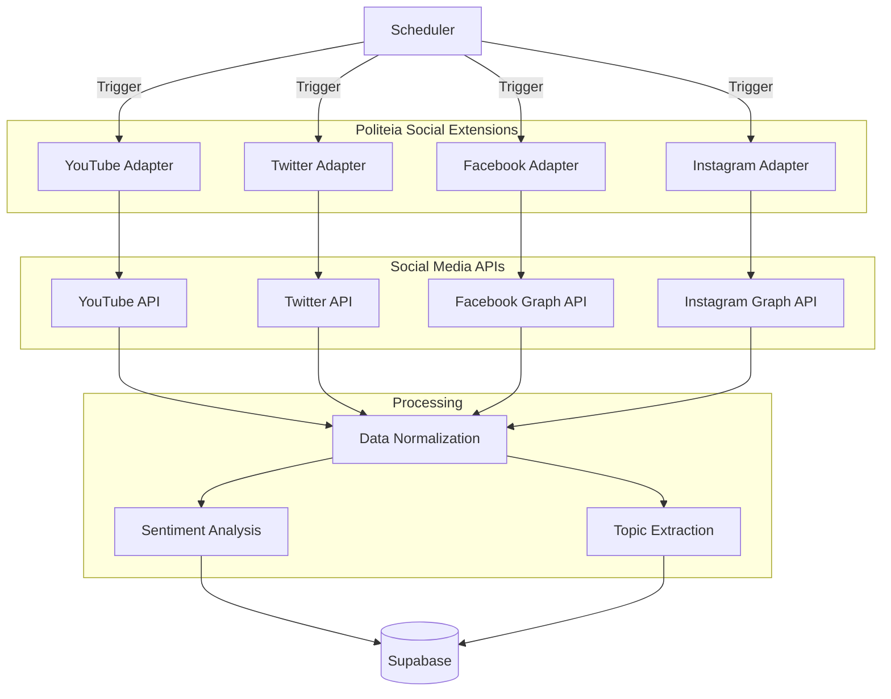

# Social Media Extensions Overview

Extend Politeia to monitor social media platforms for political content, public opinion, and civic engagement.

---

## Supported Platforms

| Platform | Status | Authentication | Rate Limits | Cost |
|----------|--------|---------------|-------------|------|
| **YouTube** | ✅ Implemented | API Key | 10K units/day | Free |
| **X (Twitter)** | 🚧 In Progress | Bearer Token | 450/15min | $100/month (Basic) |
| **Facebook** | 📋 Planned | OAuth 2.0 | Varies | Free-Paid tiers |
| **Instagram** | 📋 Planned | OAuth 2.0 | 200/hour | Free (Graph API) |

---

## Use Cases

### 1. Political Communication Monitoring

Track how politicians communicate with citizens across platforms:

```typescript
const politician = {
  name: 'Mark Rutte',
  channels: {
    youtube: 'UCxxx',
    twitter: '@markrutte',
    facebook: 'markrutteofficial',
    instagram: '@markrutte'
  }
};

// Monitor all channels
const activity = await monitorPolitician(politician);
// Returns: posts, videos, tweets, reach, engagement
```

### 2. Public Opinion Analysis

Analyze public sentiment on政治 topics:

```typescript
const topic = 'klimaatbeleid';

const sentiment = await analyzeSocialSentiment(topic, {
  platforms: ['youtube', 'twitter', 'facebook'],
  timeRange: 'last-7-days',
  language: 'nl'
});

// Returns: sentiment scores, trending keywords, geographic distribution
```

### 3. Civic Engagement Tracking

Monitor citizen participation in political discourse:

```typescript
const engagement = await trackCivicEngagement({
  municipality: 'oirschot',
  topics: ['gemeenteraad', 'verkiezingen', 'participatie'],
  platforms: ['all']
});

// Returns: participation rates, active users, trending discussions
```

---

## Architecture

### Multi-Platform Data Flow



---

## Unified Data Model

### Social Posts Table

```sql
CREATE TABLE social_posts (
  id UUID PRIMARY KEY DEFAULT gen_random_uuid(),
  platform VARCHAR(20) NOT NULL,  -- 'youtube', 'twitter', 'facebook', 'instagram'
  post_id VARCHAR(100) UNIQUE NOT NULL,
  author_id VARCHAR(100) NOT NULL,
  author_name VARCHAR(255) NOT NULL,
  content TEXT NOT NULL,
  post_type VARCHAR(50),  -- 'video', 'tweet', 'post', 'story'
  published_at TIMESTAMP WITH TIME ZONE NOT NULL,

  -- Engagement metrics
  views BIGINT DEFAULT 0,
  likes INTEGER DEFAULT 0,
  comments INTEGER DEFAULT 0,
  shares INTEGER DEFAULT 0,

  -- Analysis
  sentiment_score NUMERIC(3,2),  -- -1.00 to 1.00
  topics TEXT[],
  language VARCHAR(5),

  -- Metadata
  url VARCHAR(1000),
  thumbnail_url VARCHAR(500),
  metadata JSONB,

  created_at TIMESTAMP WITH TIME ZONE DEFAULT NOW(),
  updated_at TIMESTAMP WITH TIME ZONE DEFAULT NOW()
);

CREATE INDEX idx_social_posts_platform ON social_posts(platform);
CREATE INDEX idx_social_posts_author ON social_posts(author_id);
CREATE INDEX idx_social_posts_published ON social_posts(published_at DESC);
CREATE INDEX idx_social_posts_topics ON social_posts USING GIN(topics);
```

---

## Configuration

### Platform Registry

```yaml
# config/social-media.yaml
platforms:
  youtube:
    enabled: true
    apiUrl: "https://www.googleapis.com/youtube/v3"
    quotaLimit: 10000
    requestsPerMinute: 60

  twitter:
    enabled: true
    apiUrl: "https://api.twitter.com/2"
    tier: "basic"
    requestsPerMinute: 30

  facebook:
    enabled: false
    apiUrl: "https://graph.facebook.com/v18.0"

  instagram:
    enabled: false
    apiUrl: "https://graph.instagram.com"

monitoring:
  politicians:
    - name: "Mark Rutte"
      youtube: "UCxxx"
      twitter: "@markrutte"

  topics:
    - "klimaatbeleid"
    - "woningmarkt"
    - "zorg"

  municipalities:
    - "oirschot"
    - "best"
    - "eindhoven"
```

---

## API Endpoints

### Unified Social Media API

```http
POST /api/social/monitor
Content-Type: application/json

{
  "requestType": "social-monitor",
  "requestId": "uuid",
  "target": {
    "type": "politician" | "topic" | "municipality",
    "identifier": "markrutte"
  },
  "platforms": ["youtube", "twitter", "facebook"],
  "parameters": {
    "since": "2025-10-01T00:00:00Z",
    "maxPosts": 100
  }
}
```

**Response:**

```json
{
  "requestId": "uuid",
  "status": "success",
  "data": {
    "platforms": {
      "youtube": {
        "videos": 5,
        "totalViews": 125000,
        "totalComments": 850
      },
      "twitter": {
        "tweets": 23,
        "totalLikes": 5600,
        "totalRetweets": 1200
      }
    },
    "posts": [
      {
        "platform": "youtube",
        "id": "video123",
        "title": "Klimaatdebat",
        "publishedAt": "2025-10-15T14:30:00Z",
        "views": 45000,
        "sentimentScore": 0.65
      }
    ]
  }
}
```

---

## Sentiment Analysis

### Integration with AI Models

```typescript
// sentiment/analyzer.ts
import { OpenAI } from 'openai';

const openai = new OpenAI({
  apiKey: process.env.OPENAI_API_KEY
});

export async function analyzeSentiment(text: string): Promise<{
  score: number;
  label: 'positive' | 'neutral' | 'negative';
  confidence: number;
}> {
  const response = await openai.chat.completions.create({
    model: 'gpt-4',
    messages: [
      {
        role: 'system',
        content: 'Analyze the sentiment of the following Dutch text. Return a JSON object with score (-1 to 1), label (positive/neutral/negative), and confidence (0 to 1).'
      },
      {
        role: 'user',
        content: text
      }
    ],
    response_format: { type: 'json_object' }
  });

  return JSON.parse(response.choices[0].message.content);
}

// Batch processing for cost efficiency
export async function analyzeSentimentBatch(
  texts: string[]
): Promise<Array<{score: number; label: string}>> {
  // Process in batches of 10
  const batchSize = 10;
  const results = [];

  for (let i = 0; i < texts.length; i += batchSize) {
    const batch = texts.slice(i, i + batchSize);
    const batchResults = await Promise.all(
      batch.map(text => analyzeSentiment(text))
    );
    results.push(...batchResults);
  }

  return results;
}
```

---

## Topic Extraction

### Keyword Extraction

```typescript
// topics/extractor.ts
import natural from 'natural';

const TfIdf = natural.TfIdf;
const tokenizer = new natural.WordTokenizer();

export function extractTopics(texts: string[], topN: number = 5): string[] {
  const tfidf = new TfIdf();

  // Add documents
  texts.forEach(text => {
    tfidf.addDocument(text.toLowerCase());
  });

  // Extract keywords
  const keywords = new Map<string, number>();

  tfidf.listTerms(0).slice(0, topN).forEach(item => {
    keywords.set(item.term, item.tfidf);
  });

  return Array.from(keywords.keys());
}

// Example
const comments = [
  "Het klimaatbeleid moet ambitieuzer",
  "We hebben betaalbare woningen nodig",
  "Het klimaat vraagt om actie"
];

const topics = extractTopics(comments, 3);
// Returns: ['klimaat', 'klimaatbeleid', 'woningen']
```

---

## Rate Limiting & Quota Management

### Unified Quota System

```typescript
// quota/manager.ts
interface PlatformQuota {
  platform: string;
  dailyLimit: number;
  used: number;
  resetAt: Date;
}

class QuotaManager {
  private quotas: Map<string, PlatformQuota> = new Map();

  async canMakeRequest(platform: string, cost: number = 1): Promise<boolean> {
    const quota = this.quotas.get(platform);
    if (!quota) return true;

    // Check if reset needed
    if (new Date() >= quota.resetAt) {
      quota.used = 0;
      quota.resetAt = this.getNextReset();
    }

    return quota.used + cost <= quota.dailyLimit;
  }

  async consumeQuota(platform: string, cost: number = 1) {
    const quota = this.quotas.get(platform);
    if (!quota) return;

    quota.used += cost;
    await this.saveQuota(quota);
  }

  private getNextReset(): Date {
    const tomorrow = new Date();
    tomorrow.setDate(tomorrow.getDate() + 1);
    tomorrow.setHours(0, 0, 0, 0);
    return tomorrow;
  }

  private async saveQuota(quota: PlatformQuota) {
    await redis.set(
      `quota:${quota.platform}`,
      JSON.stringify(quota),
      'EX',
      86400
    );
  }
}

// Usage
const quotaManager = new QuotaManager();

if (await quotaManager.canMakeRequest('youtube', 1)) {
  const videos = await youtube.getChannelVideos(channelId);
  await quotaManager.consumeQuota('youtube', 1);
} else {
  console.log('YouTube quota exhausted');
}
```

---

## Privacy & Compliance

### GDPR Considerations

**Data Minimization:**
```typescript
// Only store necessary fields
interface MinimalSocialPost {
  id: string;
  platform: string;
  content: string;  // Public content only
  publishedAt: Date;
  metrics: {
    views: number;
    likes: number;
  };
  // NO personal identifiable information beyond public usernames
}
```

**Data Retention:**
```sql
-- Auto-delete old social media data
CREATE OR REPLACE FUNCTION delete_old_social_posts()
RETURNS void AS $$
BEGIN
  DELETE FROM social_posts
  WHERE created_at < NOW() - INTERVAL '90 days';
END;
$$ LANGUAGE plpgsql;

-- Schedule daily cleanup
SELECT cron.schedule(
  'cleanup-social-posts',
  '0 3 * * *',
  'SELECT delete_old_social_posts()'
);
```

**Terms of Service Compliance:**
- ✅ Only scrape public content
- ✅ Respect robots.txt
- ✅ Use official APIs where available
- ✅ Honor rate limits
- ❌ Do not impersonate users
- ❌ Do not automate actions (likes, follows)

---

## Platform-Specific Guides

Detailed documentation for each platform:

- [YouTube Extension](./youtube.md) - Videos, channels, comments, transcripts
- [X/Twitter Extension](./twitter-x.md) - Tweets, threads, profiles
- [Facebook Extension](./facebook.md) - Posts, pages, public groups
- [Instagram Extension](./instagram.md) - Posts, stories, hashtags
- [Generic Scraping](./generic-scraping.md) - Custom websites

---

## Related Documentation

- [API Reference](../03-api/external-api.md)
- [Data Models](../06-data-models/supabase-schema.md)
- [Operations Guide](../09-operations/maintenance.md)

---

[← Back to Documentation Index](../README.md)
