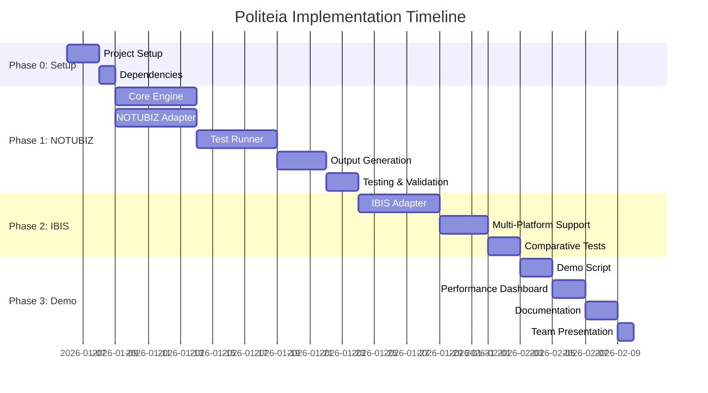

# Politeia Implementation Roadmap

> **Doel:** Operationele standalone Scraping-as-a-Service met maandelijkse self-testing en team demonstratie

**Status:** Planning - Januari 2026
**Versie:** 1.0.0-alpha
**Doelgroep:** Development Team & Stakeholders

---

## 📋 Executive Summary

Dit roadmap beschrijft de gefaseerde implementatie van Politeia, een configuration-driven scraping platform voor gemeentelijke informatie. De focus ligt op:

1. **Standalone Operatie** - Volledig functioneel zonder externe systeem dependencies
2. **Maandelijkse Self-Testing** - Geautomatiseerde validatie tegen echte gemeente websites
3. **Team Demonstratie** - Aantoonbare waarde en potentie voor stakeholders
4. **Production-Ready Foundation** - Basis voor toekomstige uitbreidingen

### Key Deliverables

✅ **Fase 1:** NOTUBIZ/Oirschot scraper (2-3 weken)
✅ **Fase 2:** IBIS/Tilburg scraper (1-2 weken)
✅ **Fase 3:** Demo & documentatie (1 week)

**Totale tijdlijn:** 4-6 weken

---

## 🎯 Project Scope

### In Scope
- ✅ Standalone scraping engine met Browserbase
- ✅ NOTUBIZ platform support (Oirschot)
- ✅ IBIS platform support (Tilburg)
- ✅ Maandelijkse validatie tests
- ✅ Human-readable + machine-readable output
- ✅ Session monitoring en logging
- ✅ Performance metrics
- ✅ Demo environment
- ✅ Team documentatie

### Out of Scope (Toekomstige Fases)
- ❌ External system integration (Supabase, schedulers)
- ❌ Production API deployment
- ❌ Multi-tenant support
- ❌ Authentication/authorization
- ❌ Change detection workflows
- ❌ Notification systems

---

## 📊 Implementation Architecture

```mermaid
graph TB
    subgraph "Phase 1: NOTUBIZ/Oirschot"
        CLI1[CLI Test Runner]
        Engine1[Scraper Engine]
        NOTUBIZ[NOTUBIZ Adapter]
        BB1[Browserbase Session]
        Oirschot[Oirschot Website]
        Output1[Output Generator]
    end

    subgraph "Phase 2: IBIS/Tilburg"
        Engine2[Scraper Engine]
        IBIS[IBIS Adapter]
        BB2[Browserbase Session]
        Tilburg[Tilburg Website]
        Output2[Output Generator]
    end

    subgraph "Phase 3: Demo Environment"
        Demo[Demo Script]
        Dashboard[Performance Dashboard]
        Reports[Human Reports]
    end

    CLI1 --> Engine1
    Engine1 --> NOTUBIZ
    NOTUBIZ --> BB1
    BB1 --> Oirschot
    Engine1 --> Output1

    Engine2 --> IBIS
    IBIS --> BB2
    BB2 --> Tilburg
    Engine2 --> Output2

    Output1 --> Demo
    Output2 --> Demo
    Demo --> Dashboard
    Dashboard --> Reports

    style "Phase 1: NOTUBIZ/Oirschot" fill:#e1f5ff
    style "Phase 2: IBIS/Tilburg" fill:#fff4e6
    style "Phase 3: Demo Environment" fill:#f3e5f5
```

---

## 🚀 Phase 0: Project Setup

**Duur:** 2-3 dagen
**Doel:** Development environment klaar voor implementatie

### Tasks

#### 0.1 Project Structure
```bash
examples/politeia/
├── src/
│   ├── core/              # Core scraping engine
│   ├── platforms/         # Platform-specific adapters
│   │   ├── notubiz/
│   │   └── ibis/
│   ├── testing/           # Test runner & validators
│   ├── output/            # Output generators
│   └── utils/             # Shared utilities
├── tests/
│   ├── unit/
│   └── integration/
├── output/                # Test results (gitignored)
├── config/
│   ├── platforms/         # Platform configurations
│   └── municipalities/    # Municipality settings
└── scripts/               # CLI & demo scripts
```

#### 0.2 Dependencies
```json
{
  "dependencies": {
    "@browserbase/stagehand": "^2.0.0",
    "playwright": "^1.40.0",
    "typescript": "^5.3.0",
    "date-fns": "^3.0.0",
    "commander": "^11.1.0",
    "winston": "^3.11.0",
    "zod": "^3.22.0"
  },
  "devDependencies": {
    "@types/node": "^20.10.0",
    "ts-node": "^10.9.2",
    "vitest": "^1.0.0"
  }
}
```

#### 0.3 Environment Configuration
```bash
# .env.example
BROWSERBASE_API_KEY=bb_your_api_key
BROWSERBASE_PROJECT_ID=prj_your_project_id
BROWSERBASE_TIMEOUT=60000

# Politeia Configuration
POLITEIA_OUTPUT_DIR=./output
POLITEIA_LOG_LEVEL=info
POLITEIA_MAX_RETRIES=3
POLITEIA_PARALLEL_SESSIONS=false

# Test Configuration
TEST_MONTH=auto  # or specific: 9 (October)
TEST_YEAR=auto   # or specific: 2025
```

### Deliverables
- ✅ Project structure created
- ✅ Dependencies installed and working
- ✅ Environment variables configured
- ✅ TypeScript compilation working
- ✅ Basic CLI scaffold created

---

## 🏗️ Phase 1: NOTUBIZ / Gemeente Oirschot

**Duur:** 2-3 weken
**Doel:** Volledige end-to-end scraping met demonstreerbare output

### 1.1 Core Scraper Engine (Week 1)

#### Scraper Engine Implementation
```typescript
// src/core/scraper-engine.ts
export class ScraperEngine {
  constructor(
    private browserbase: Browserbase,
    private platformAdapter: PlatformAdapter,
    private logger: Logger
  ) {}

  async scrapeMonth(
    municipalityConfig: MunicipalityConfig,
    month: number,
    year: number
  ): Promise<MeetingData[]> {
    // 1. Initialize Browserbase session
    // 2. Navigate to calendar
    // 3. Filter by month/year
    // 4. Extract meeting list
    // 5. Scrape each meeting detail
    // 6. Return structured data
  }

  async scrapeMeeting(
    url: string
  ): Promise<MeetingDetail> {
    // 1. Navigate to meeting page
    // 2. Extract meeting metadata
    // 3. Extract agenda items
    // 4. Extract documents
    // 5. Return structured meeting data
  }
}
```

#### Platform Adapter Interface
```typescript
// src/platforms/platform-adapter.ts
export interface PlatformAdapter {
  name: string;
  version: string;

  // Navigation
  getCalendarUrl(baseUrl: string, month: number, year: number): string;

  // Selectors
  getSelectors(): PlatformSelectors;

  // Parsing
  parseMeetingList(page: Page): Promise<MeetingReference[]>;
  parseMeetingDetail(page: Page): Promise<MeetingDetail>;
  parseAgendaItems(page: Page): Promise<AgendaItem[]>;
  parseDocuments(page: Page): Promise<Document[]>;

  // Validation
  validateMeeting(meeting: MeetingDetail): ValidationResult;
}
```

### 1.2 NOTUBIZ Adapter Implementation (Week 1)

```typescript
// src/platforms/notubiz/notubiz-adapter.ts
export class NotubizAdapter implements PlatformAdapter {
  name = 'NOTUBIZ';
  version = '2.0.0';

  getCalendarUrl(baseUrl: string, month: number, year: number): string {
    return `${baseUrl}/Vergaderingen?month=${month}&year=${year}`;
  }

  getSelectors(): PlatformSelectors {
    return {
      // Calendar selectors
      meetingList: '.vergaderingen-lijst',
      meetingItem: '.vergadering-item',
      meetingTitle: '.vergadering-titel',
      meetingDate: '.vergadering-datum',
      meetingUrl: '.vergadering-link',

      // Meeting detail selectors
      agendaItems: '.agendapunt',
      agendaNumber: '.agendapunt-nummer',
      agendaTitle: '.agendapunt-titel',

      // Document selectors
      documents: '.document-lijst .document',
      documentTitle: '.document-titel',
      documentUrl: '.document-link',
      documentType: '.document-type'
    };
  }

  async parseMeetingList(page: Page): Promise<MeetingReference[]> {
    // Implementation specific to NOTUBIZ HTML structure
  }

  // ... other adapter methods
}
```

### 1.3 Oirschot Configuration (Week 1)

```typescript
// config/municipalities/oirschot.ts
export const oirschotConfig: MunicipalityConfig = {
  id: 'oirschot',
  name: 'Gemeente Oirschot',
  platform: 'NOTUBIZ',
  platformVersion: '2.0.0',

  urls: {
    base: 'https://oirschot.bestuurlijkeinformatie.nl',
    calendar: 'https://oirschot.bestuurlijkeinformatie.nl/Vergaderingen'
  },

  scraping: {
    timeout: 60000,
    retries: 3,
    waitForSelector: 'networkidle',
    screenshots: true
  },

  validation: {
    requiredFields: ['title', 'date', 'agendaItems', 'documents'],
    minAgendaItems: 1,
    minDocuments: 0
  }
};
```

### 1.4 Test Runner Implementation (Week 2)

```typescript
// src/testing/monthly-validator.ts
export class MonthlyValidator {
  async run(config: TestConfig): Promise<TestResults> {
    const testRunId = this.generateTestRunId();
    const outputPath = this.createOutputStructure(testRunId);

    this.logger.info(`Starting validation: ${testRunId}`);

    const results: TestResults = {
      testRunId,
      executedAt: new Date(),
      municipalities: []
    };

    for (const municipality of config.municipalities) {
      const municipalityResults = await this.testMunicipality(
        municipality,
        config.month,
        config.year
      );

      results.municipalities.push(municipalityResults);

      // Generate outputs
      await this.generateOutputs(
        municipalityResults,
        outputPath
      );
    }

    // Generate summary
    await this.generateSummary(results, outputPath);

    return results;
  }

  private async testMunicipality(
    municipality: MunicipalityConfig,
    month: number,
    year: number
  ): Promise<MunicipalityTestResult> {
    const sessionLogger = this.createSessionLogger(municipality.id);

    try {
      // Initialize Browserbase session
      const session = await this.browserbase.createSession({
        projectId: process.env.BROWSERBASE_PROJECT_ID!,
        keepAlive: true
      });

      sessionLogger.info(`Session created: ${session.id}`);

      // Scrape municipality data
      const meetings = await this.scraper.scrapeMonth(
        municipality,
        month,
        year
      );

      sessionLogger.info(`Scraped ${meetings.length} meetings`);

      // Validate results
      const validation = this.validator.validate(meetings);

      return {
        municipality: municipality.id,
        success: validation.passed,
        meetings,
        validation,
        session: {
          id: session.id,
          recordingUrl: session.recordingUrl,
          duration: session.duration
        }
      };
    } catch (error) {
      sessionLogger.error('Test failed', error);
      return {
        municipality: municipality.id,
        success: false,
        error: error.message
      };
    }
  }
}
```

### 1.5 Output Generation (Week 2)

#### JSON Output
```typescript
// src/output/json-generator.ts
export class JsonOutputGenerator {
  async generate(
    results: MunicipalityTestResult,
    outputPath: string
  ): Promise<void> {
    const data = {
      municipality: results.municipality,
      scrapedAt: new Date().toISOString(),
      meetingsCount: results.meetings.length,
      meetings: results.meetings.map(meeting => ({
        id: meeting.id,
        title: meeting.title,
        date: meeting.date.toISOString(),
        location: meeting.location,
        status: meeting.status,
        url: meeting.url,
        agendaItemsCount: meeting.agendaItems.length,
        documentsCount: meeting.documents.length,
        agendaItems: meeting.agendaItems,
        documents: meeting.documents
      }))
    };

    const filePath = path.join(
      outputPath,
      'results',
      results.municipality,
      'meetings.json'
    );

    await fs.writeFile(
      filePath,
      JSON.stringify(data, null, 2),
      'utf-8'
    );
  }
}
```

#### Markdown Output
```typescript
// src/output/markdown-generator.ts
export class MarkdownOutputGenerator {
  async generateOverview(
    results: MunicipalityTestResult,
    outputPath: string
  ): Promise<void> {
    const md = `# ${results.municipalityName} - ${this.formatMonth(month, year)}

**Platform:** ${results.platform} ${results.platformVersion}
**Scraped:** ${new Date().toISOString()}
**Total Meetings:** ${results.meetings.length}

## Meetings

${results.meetings.map((meeting, idx) => `
### ${idx + 1}. ${meeting.title} - ${format(meeting.date, 'MMMM d, yyyy')}

**Time:** ${format(meeting.date, 'HH:mm')}
**Location:** ${meeting.location}
**Status:** ${meeting.status}
**URL:** ${meeting.url}

**Agenda Items:** ${meeting.agendaItems.length}
**Documents:** ${meeting.documents.length}

**Agenda Overview:**
${meeting.agendaItems.map((item, i) => `${i + 1}. ${item.title}`).join('\n')}

**Key Documents:**
${meeting.documents.slice(0, 5).map(doc => `- ${doc.title} (${this.formatBytes(doc.size)})`).join('\n')}

---
`).join('\n')}`;

    const filePath = path.join(
      outputPath,
      'results',
      results.municipality,
      'overview.md'
    );

    await fs.writeFile(filePath, md, 'utf-8');
  }

  async generateMeetingFile(
    meeting: MeetingDetail,
    outputPath: string
  ): Promise<void> {
    // Generate complete meeting markdown
    // Generate agenda-only markdown
    // Generate documents-only markdown
  }
}
```

### 1.6 CLI Interface (Week 2)

```typescript
// scripts/politeia-cli.ts
import { Command } from 'commander';

const program = new Command();

program
  .name('politeia')
  .description('Politeia Scraping-as-a-Service CLI')
  .version('1.0.0');

program
  .command('test')
  .description('Run monthly validation test')
  .option('-m, --month <number>', 'Month to test (0-11)')
  .option('-y, --year <number>', 'Year to test')
  .option('--municipality <id>', 'Test specific municipality')
  .option('-v, --verbose', 'Verbose output')
  .action(async (options) => {
    const validator = new MonthlyValidator({
      month: options.month ? parseInt(options.month) : getPreviousMonth(),
      year: options.year ? parseInt(options.year) : new Date().getFullYear(),
      municipalities: options.municipality
        ? [getMunicipalityConfig(options.municipality)]
        : getAllMunicipalityConfigs(),
      verbose: options.verbose || false
    });

    const results = await validator.run();
    console.log(`✅ Test complete: ${results.testRunId}`);
  });

program
  .command('scrape')
  .description('Scrape specific municipality')
  .requiredOption('-u, --url <url>', 'Municipality URL')
  .option('-p, --platform <platform>', 'Platform type (NOTUBIZ, IBIS)')
  .action(async (options) => {
    // Scrape single municipality
  });

program.parse();
```

### 1.7 Logging & Monitoring (Week 3)

```typescript
// src/utils/logger.ts
import winston from 'winston';

export class Logger {
  private logger: winston.Logger;

  constructor(context: string) {
    this.logger = winston.createLogger({
      level: process.env.POLITEIA_LOG_LEVEL || 'info',
      format: winston.format.combine(
        winston.format.timestamp(),
        winston.format.errors({ stack: true }),
        winston.format.json()
      ),
      defaultMeta: { context },
      transports: [
        new winston.transports.File({
          filename: `logs/${context}.log`
        }),
        new winston.transports.Console({
          format: winston.format.combine(
            winston.format.colorize(),
            winston.format.simple()
          )
        })
      ]
    });
  }

  info(message: string, meta?: any) {
    this.logger.info(message, meta);
  }

  error(message: string, error?: Error) {
    this.logger.error(message, { error });
  }

  debug(message: string, meta?: any) {
    this.logger.debug(message, meta);
  }
}
```

### Phase 1 Deliverables

✅ **Working NOTUBIZ/Oirschot scraper**
- [x] Scrapes monthly calendar
- [x] Extracts meeting details
- [x] Parses agenda items
- [x] Extracts documents with URLs
- [x] Handles errors gracefully

✅ **Output Generation**
- [x] JSON files (machine-readable)
- [x] Markdown files (human-readable)
- [x] Per-meeting breakdown files
- [x] Summary reports

✅ **Test Runner**
- [x] CLI interface
- [x] Configurable month/year
- [x] Progress logging
- [x] Session monitoring

✅ **Demo-Ready**
- [x] Run: `npm run test:oirschot`
- [x] View: `output/latest/summary.md`
- [x] Validate: Compare with actual website

---

## 🏗️ Phase 2: IBIS / Gemeente Tilburg

**Duur:** 1-2 weken
**Doel:** Multi-platform support met vergelijkende tests

### 2.1 IBIS Adapter Implementation (Week 1)

```typescript
// src/platforms/ibis/ibis-adapter.ts
export class IbisAdapter implements PlatformAdapter {
  name = 'IBIS';
  version = '1.0.0';

  getCalendarUrl(baseUrl: string, month: number, year: number): string {
    // IBIS has different URL structure
    return `${baseUrl}/Calendar/Month/${year}/${month}`;
  }

  getSelectors(): PlatformSelectors {
    return {
      // IBIS-specific selectors
      meetingList: '.meeting-list',
      meetingItem: '.meeting-row',
      // ... different from NOTUBIZ
    };
  }

  async parseMeetingList(page: Page): Promise<MeetingReference[]> {
    // IBIS-specific parsing logic
  }
}
```

### 2.2 Tilburg Configuration

```typescript
// config/municipalities/tilburg.ts
export const tilburgConfig: MunicipalityConfig = {
  id: 'tilburg',
  name: 'Gemeente Tilburg',
  platform: 'IBIS',
  platformVersion: '1.0.0',

  urls: {
    base: 'https://tilburg.raadsinformatie.nl',
    calendar: 'https://tilburg.raadsinformatie.nl/Calendar'
  },

  scraping: {
    timeout: 60000,
    retries: 3,
    waitForSelector: 'domcontentloaded'
  }
};
```

### 2.3 Multi-Platform Test Runner (Week 2)

```typescript
// Extend test runner to handle multiple platforms
export class MultiPlatformValidator extends MonthlyValidator {
  async runComparison(
    municipalities: MunicipalityConfig[],
    month: number,
    year: number
  ): Promise<ComparisonResults> {
    // Run tests in parallel
    const results = await Promise.all(
      municipalities.map(m => this.testMunicipality(m, month, year))
    );

    // Generate comparison report
    return this.generateComparison(results);
  }
}
```

### Phase 2 Deliverables

✅ **Working IBIS/Tilburg scraper**
✅ **Multi-platform support in test runner**
✅ **Comparative analysis reports**
✅ **Platform-agnostic core engine**

---

## 🎭 Phase 3: Demo & Documentation

**Duur:** 1 week
**Doel:** Team demonstratie en stakeholder presentatie

### 3.1 Interactive Demo Script (Days 1-2)

```typescript
// scripts/demo.ts
export class PoliteiaDemoRunner {
  async runInteractiveDemo() {
    console.log('🎯 Politeia Demo - Scraping-as-a-Service\n');

    // 1. Show system initialization
    await this.showInitialization();

    // 2. Run live scraping demo (Oirschot)
    await this.runLiveScraping('oirschot');

    // 3. Show output generation
    await this.showOutputGeneration();

    // 4. Display performance metrics
    await this.showPerformanceMetrics();

    // 5. Show validation results
    await this.showValidationResults();

    // 6. Open Browserbase session recording
    await this.showSessionRecording();
  }

  private async runLiveScraping(municipalityId: string) {
    console.log(`\n📊 Starting scraping: ${municipalityId}`);
    console.log('⏱️  Watch live: [Browserbase Session URL]');

    const spinner = ora('Scraping in progress...').start();

    const results = await this.scraper.scrape(municipalityId);

    spinner.succeed(`Scraped ${results.meetings.length} meetings`);

    // Show progress in real-time
    this.displayProgress(results);
  }
}
```

### 3.2 Performance Dashboard (Days 3-4)

```typescript
// src/demo/performance-dashboard.ts
export class PerformanceDashboard {
  async generateReport(results: TestResults): Promise<DashboardData> {
    return {
      // Execution metrics
      totalDuration: results.duration.total,
      avgMeetingTime: this.calculateAverage(results.timings),
      successRate: this.calculateSuccessRate(results),

      // Scraping metrics
      totalMeetings: results.totalMeetings,
      totalAgendaItems: results.totalAgendaItems,
      totalDocuments: results.totalDocuments,

      // Browser metrics
      sessionsCreated: results.sessions.length,
      totalPageLoads: results.metrics.pageLoads,
      avgPageLoadTime: results.metrics.avgPageLoadTime,

      // Quality metrics
      validationFailures: results.validation.failures,
      missingData: results.validation.missingFields,

      // Charts
      meetingsPerMunicipality: this.generateChart(results),
      performanceTimeline: this.generateTimeline(results)
    };
  }
}
```

### 3.3 Demo Output Examples (Day 5)

```markdown
# Demo Run: October 2025

## 📊 Results Summary

| Municipality | Platform | Meetings | Agenda Items | Documents | Duration | Status |
|--------------|----------|----------|--------------|-----------|----------|--------|
| Oirschot     | NOTUBIZ  | 3        | 18           | 52        | 2m 15s   | ✅ PASS |
| Tilburg      | IBIS     | 5        | 34           | 89        | 3m 42s   | ✅ PASS |

## 🎥 Session Recordings

- **Oirschot:** [View Browserbase Recording](https://browserbase.com/sessions/abc123)
- **Tilburg:** [View Browserbase Recording](https://browserbase.com/sessions/def456)

## 📈 Performance Metrics

- **Total Duration:** 5m 57s
- **Success Rate:** 100%
- **Avg Meeting Scrape Time:** 24s
- **Total Data Extracted:** 8 meetings, 52 agenda items, 141 documents

## 🔍 Sample Meeting Output

**Gemeenteraad Oirschot - October 3, 2025**

```json
{
  "title": "Gemeenteraad",
  "date": "2025-10-03T19:30:00Z",
  "agendaItems": 8,
  "documents": 23,
  "url": "https://oirschot.bestuurlijkeinformatie.nl/..."
}
```

**Human-Readable:** [View Meeting Summary](./oirschot/2025-10-03-gemeenteraad.md)
```

### 3.4 Team Presentation Materials

#### PowerPoint/Slides Content:
1. **Problem Statement** - Manual scraping is time-consuming
2. **Solution** - Automated, configuration-driven scraping
3. **Architecture** - How it works (diagram)
4. **Live Demo** - Screen recording or live scraping
5. **Results** - Actual output from tests
6. **Value Proposition** - Time savings, accuracy, scalability
7. **Roadmap** - Future enhancements

#### Demo Video Script:
```
[00:00] Introduction - "What is Politeia?"
[00:30] Setup - "One command to run"
[01:00] Live Scraping - "Watch it in action"
[02:30] Output Review - "Human and machine readable"
[03:30] Validation - "Compare with actual website"
[04:30] Performance Metrics - "Fast and reliable"
[05:00] Next Steps - "Ready for expansion"
```

### 3.5 User Guide for Monthly Testing

```markdown
# Monthly Testing Workflow

## Quick Start

### 1. Run Monthly Test
```bash
npm run test:monthly
```

This automatically:
- Determines the most recently completed month
- Runs scrapers for all configured municipalities
- Generates comprehensive reports
- Saves results to `output/[timestamp]/`

### 2. Review Results

Open the summary file:
```bash
cat output/latest/summary.md
```

### 3. Validate Against Actual Websites

For each municipality:
1. Open municipality website calendar
2. Compare meeting count
3. Spot-check 3 random meetings
4. Verify document URLs

### 4. Approve or Report Issues

If all checks pass:
```bash
npm run approve-test-run -- --run-id=[timestamp]
```

If issues found:
```bash
npm run report-issues -- --run-id=[timestamp] --description="..."
```

## Advanced Usage

### Test Specific Month
```bash
npm run test:monthly -- --month=9 --year=2025
```

### Test Single Municipality
```bash
npm run test:monthly -- --municipality=oirschot
```

### Verbose Output
```bash
npm run test:monthly -- --verbose
```

## Output Structure

```
output/2025-10-15T14-30-00Z/
├── metadata.json              # Test run metadata
├── summary.md                 # Human-readable summary
├── logs/
│   ├── test-execution.log     # Full execution log
│   └── oirschot.log           # Municipality-specific logs
└── results/
    └── oirschot/
        ├── overview.md        # Monthly overview
        ├── meetings.json      # Complete data
        └── meetings/
            ├── 2025-10-03-gemeenteraad.md
            └── ...
```

## Troubleshooting

See [Troubleshooting Guide](../09-operations/troubleshooting.md) for common issues.
```

### Phase 3 Deliverables

✅ **Interactive demo script**
✅ **Performance dashboard**
✅ **Team presentation materials**
✅ **Demo video/recording**
✅ **User guide for monthly testing**
✅ **Stakeholder documentation**

---

## 📅 Timeline Overview



**Key Milestones:**
- ✅ **Week 2:** First successful Oirschot scraping test
- ✅ **Week 3:** Complete NOTUBIZ implementation with outputs
- ✅ **Week 5:** Multi-platform support (NOTUBIZ + IBIS)
- ✅ **Week 6:** Demo-ready with presentation materials

---

## 🎯 Success Criteria

### Technical Success
- [ ] Scrapes complete month of meetings without errors
- [ ] Generates both JSON and Markdown outputs
- [ ] Success rate > 95% for all municipalities
- [ ] Average scrape time < 30 seconds per meeting
- [ ] All validation checks pass
- [ ] Browserbase sessions recorded and accessible

### Demo Success
- [ ] Live demo runs without failures
- [ ] Output is clearly understandable by non-technical viewers
- [ ] Performance metrics show value proposition
- [ ] Team understands how to run monthly tests
- [ ] Stakeholders approve for next phase

### Documentation Success
- [ ] User can run tests without assistance
- [ ] Troubleshooting guide covers common issues
- [ ] Architecture is documented for future developers
- [ ] Configuration system is documented

---

## 🚧 Risks & Mitigations

### Technical Risks

| Risk | Impact | Probability | Mitigation |
|------|--------|-------------|------------|
| Website structure changes | High | Medium | Extensive logging, version control of selectors |
| Browserbase downtime | High | Low | Implement retry logic, fallback to local browser |
| Rate limiting | Medium | Medium | Implement delays, respect robots.txt |
| Dynamic content loading | Medium | High | Wait for network idle, use explicit waits |

### Project Risks

| Risk | Impact | Probability | Mitigation |
|------|--------|-------------|------------|
| Timeline overruns | Medium | Medium | Buffer time in estimates, prioritize MVP features |
| Requirements change | High | Medium | Modular design, clear phase boundaries |
| Resource unavailability | Medium | Low | Good documentation, pair programming |

---

## 📊 Resource Requirements

### Development Resources
- **1 Senior Developer** - Full-time, 4-6 weeks
- **1 QA/Tester** - Part-time, 2 weeks (Phases 1-2)
- **1 Technical Writer** - Part-time, 1 week (Phase 3)

### Infrastructure
- **Browserbase Account** - Pro plan ($99/month)
- **Development Environment** - Local or cloud
- **Git Repository** - GitHub/GitLab
- **CI/CD Pipeline** - Optional for Phase 1-3

### Tools
- TypeScript/Node.js development environment
- Playwright browser automation
- Browserbase Stagehand SDK
- Winston logging
- Commander.js CLI framework

---

## 🔄 Next Steps After Demo

### Short-Term (1-2 months)
1. **External System Integration** - Connect to Supabase
2. **API Development** - REST API for external requests
3. **Scheduler Integration** - Automated daily/weekly scraping
4. **Change Detection** - Identify and alert on changes

### Medium-Term (3-6 months)
1. **Multi-Tenant Support** - Support multiple clients
2. **Additional Platforms** - More gemeente platforms
3. **Social Media Scrapers** - YouTube, X, Facebook
4. **Production Deployment** - Docker, Kubernetes

### Long-Term (6-12 months)
1. **AI-Powered Extraction** - LLM-based content analysis
2. **Mobile Apps** - Mobile access to scraped data
3. **Analytics Dashboard** - Trend analysis, insights
4. **API Marketplace** - Public API for developers

---

## 📞 Project Contacts

- **Project Lead:** [Name]
- **Technical Lead:** [Name]
- **Product Owner:** [Name]
- **Stakeholders:** [Names]

---

## 📝 Appendices

### Appendix A: Technology Stack
- **Runtime:** Node.js 18+
- **Language:** TypeScript 5.3+
- **Browser Automation:** Playwright 1.40+
- **Cloud Browser:** Browserbase Stagehand
- **CLI:** Commander.js 11+
- **Logging:** Winston 3.11+
- **Validation:** Zod 3.22+
- **Date Handling:** date-fns 3.0+

### Appendix B: Configuration Files
- Platform configurations: `/config/platforms/`
- Municipality configurations: `/config/municipalities/`
- Environment variables: `.env.example`

### Appendix C: Output Formats
- JSON schema: See documentation
- Markdown templates: See documentation
- Validation rules: See documentation

---

**Document Version:** 1.0.0
**Last Updated:** January 6, 2026
**Status:** Draft - Awaiting Approval

---

[← Back to Documentation Index](./README.md)
