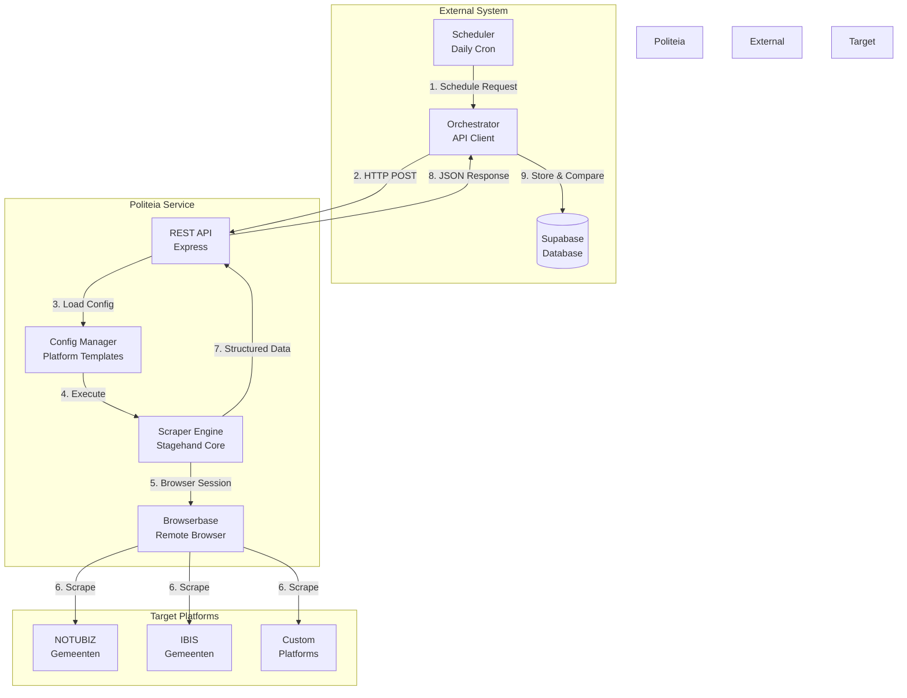

# Politeia Documentation

> **Politeia** (Πολιτεία) - Greek for "political community" or "citizenship"

A scalable, configuration-driven Scraping-as-a-Service platform for extracting governmental and public information from municipal portals and beyond.

---

## 📚 Documentation Index

### [01. General Information](./01-general/)
- [**Overview**](./01-general/overview.md) - What is Politeia?
- [**Quick Start**](./01-general/quickstart.md) - Get started in 5 minutes
- [**FAQ**](./01-general/faq.md) - Frequently asked questions
- [**Glossary**](./01-general/glossary.md) - Terms and definitions

### [02. System Architecture](./02-architecture/)
- [**System Overview**](./02-architecture/system-overview.md) - High-level architecture
- [**Components**](./02-architecture/components.md) - Core components explained
- [**Data Flow**](./02-architecture/data-flow.md) - How data moves through the system
- [**Diagrams**](./02-architecture/diagrams/) - Architecture diagrams

### [03. External API](./03-api/)
- [**API Reference**](./03-api/external-api.md) - Complete API documentation
- [**Request Schemas**](./03-api/request-schemas.md) - Request format specifications
- [**Response Schemas**](./03-api/response-schemas.md) - Response format specifications
- [**Authentication**](./03-api/authentication.md) - API authentication methods

### [04. Platform Support](./04-platforms/)
- [**NOTUBIZ**](./04-platforms/notubiz.md) - NOTUBIZ platform configuration
- [**IBIS**](./04-platforms/ibis.md) - IBIS platform configuration
- [**Version Management**](./04-platforms/version-management.md) - Managing platform changes
- [**Adding Platforms**](./04-platforms/adding-new-platforms.md) - How to add support for new platforms

### [05. Browserbase Integration](./05-browserbase/)
- [**Session Management**](./05-browserbase/session-management.md) - Managing browser sessions
- [**Logging**](./05-browserbase/logging.md) - Session logging and debugging
- [**Error Handling**](./05-browserbase/error-handling.md) - Handling browser errors
- [**Best Practices**](./05-browserbase/best-practices.md) - Optimization tips

### [06. Data Models](./06-data-models/)
- [**Supabase Schema**](./06-data-models/supabase-schema.md) - Database schema design
- [**Entities**](./06-data-models/entities.md) - Entity definitions
- [**Relationships**](./06-data-models/relationships.md) - Entity relationships

### [07. Deployment](./07-deployment/)
- [**Docker**](./07-deployment/docker.md) - Container deployment
- [**Kubernetes**](./07-deployment/kubernetes.md) - K8s orchestration
- [**Serverless**](./07-deployment/serverless.md) - Serverless deployment options
- [**Monitoring**](./07-deployment/monitoring.md) - System monitoring

### [08. Extensions](./08-extensions/)
- [**Social Media**](./08-extensions/social-media.md) - Scraping social platforms
- [**YouTube**](./08-extensions/youtube.md) - YouTube data extraction
- [**Generic Scraping**](./08-extensions/generic-scraping.md) - Custom scraping adapters
- [**Custom Adapters**](./08-extensions/custom-adapters.md) - Building your own adapters

### [09. Operations](./09-operations/)
- [**Scaling**](./09-operations/scaling.md) - Scaling strategies
- [**Maintenance**](./09-operations/maintenance.md) - System maintenance
- [**Troubleshooting**](./09-operations/troubleshooting.md) - Common issues and solutions
- [**Performance**](./09-operations/performance.md) - Performance optimization

### [10. Testing & Validation](./10-testing/)
- [**Testing Overview**](./10-testing/testing-overview.md) - Sandbox testing system
- [**Implementation Guide**](./10-testing/testing-implementation.md) - Test runner implementation
- [**Validation Examples**](./10-testing/validation-examples.md) - Real-world test outputs
- [**Quick Reference**](./10-testing/quick-reference.md) - Quick validation guide

---

## 🚀 Quick Links

- **Getting Started:** [Quick Start Guide](./01-general/quickstart.md)
- **API Docs:** [External API Reference](./03-api/external-api.md)
- **Deployment:** [Docker Setup](./07-deployment/docker.md)
- **Support:** [FAQ](./01-general/faq.md) | [Troubleshooting](./09-operations/troubleshooting.md)

---

## 🗺️ Implementation Planning

### Ready to Build?

We've created comprehensive implementation documentation to guide you from planning to production:

- **[📋 Implementation Roadmap](./IMPLEMENTATION-ROADMAP.md)** - Detailed 4-6 week plan with code examples, architecture, and technical specifications
- **[⚡ Executive Summary](./IMPLEMENTATION-SUMMARY.md)** - Quick overview of timeline, phases, and deliverables

**Implementation Approach:**
1. **Phase 1:** NOTUBIZ/Oirschot scraper with full testing (2-3 weeks)
2. **Phase 2:** IBIS/Tilburg multi-platform support (1-2 weeks)
3. **Phase 3:** Demo environment and presentation materials (1 week)

**Target:** Demo-ready standalone system for monthly self-testing and stakeholder presentation

→ **Start Here:** [View Implementation Summary](./IMPLEMENTATION-SUMMARY.md)

---

## 📊 System Overview

---

## 🎯 Key Features

✅ **Configuration-Driven** - Add platforms without code changes
✅ **Scalable** - Horizontal scaling with containerization
✅ **Extensible** - Support for governmental, social media, and custom platforms
✅ **Cost-Effective** - Browser resources only during scraping
✅ **Change Detection** - Automatic monitoring of data changes
✅ **Multi-Tenant** - Support multiple clients/municipalities

---

## 📦 Current Support

### Governmental Platforms
- ✅ **NOTUBIZ** (Decos) - Oirschot, Best, Eindhoven, 100+ gemeenten
- 🚧 **IBIS** - Amsterdam, Rotterdam, Den Haag
- 📋 **Custom** - Extensible configuration system

### Future Extensions
- 📱 **Social Media** - YouTube, Facebook, Instagram, X (Twitter)
- 🌐 **Generic Web** - Any website with structured data
- 📄 **Document Processing** - PDF, Word, Excel extraction

---

## 🏗️ Architecture Principles

1. **Separation of Concerns** - Service vs Business Logic
2. **Configuration over Code** - Platform templates
3. **Stateless Service** - External system manages state
4. **Idempotent Operations** - Safe to retry
5. **Observability** - Comprehensive logging & monitoring

---

## 📝 Version Information

- **Current Version:** 1.0.0
- **API Version:** v1
- **Last Updated:** January 6, 2026
- **Status:** Production Ready 🟢

---

## 🤝 Contributing

See [Adding New Platforms](./04-platforms/adding-new-platforms.md) for contribution guidelines.

---

## 📞 Support

- **Documentation Issues:** Create an issue in the repository
- **Platform Support:** Check [Platform Documentation](./04-platforms/)
- **API Questions:** See [API Reference](./03-api/external-api.md)
- **Troubleshooting:** Read [Troubleshooting Guide](./09-operations/troubleshooting.md)

---

**© 2026 Politeia Project**
